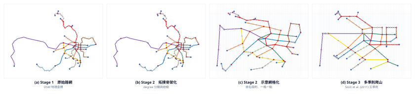
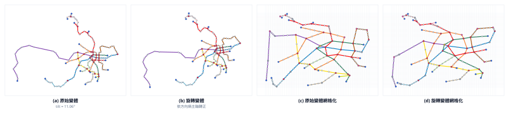
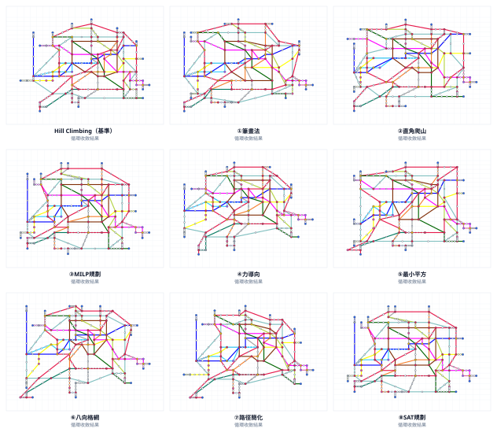
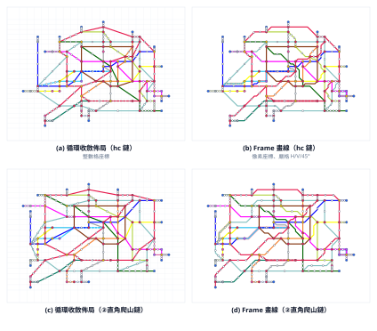
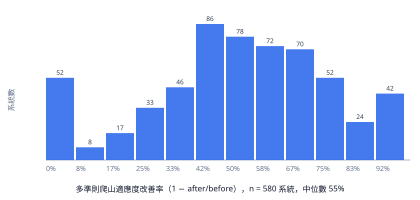

# 自適應版面的地理空間網絡資料視覺化

**Adaptive Layout Display Method for Geospatial Network Data**

鄭凱文（Kai-Wen Cheng）
指導教授：溫在弘 博士
國立臺灣大學理學院地理環境資源學系

> 博士論文文稿（草稿）・引用格式：APA 第 7 版・2026 年 7 月
> 本文稿整合博士論文計畫書（無 AI 版）、國科會計畫書（含 AI 版）與 Adapt-Metro 系統之實作成果撰寫而成。

---

## 目次

- [中文摘要](#中文摘要)
- [Abstract](#abstract)
- [第一章　緒論](#第一章緒論)
- [第二章　文獻回顧](#第二章文獻回顧)
- [第三章　研究方法](#第三章研究方法)
- [第四章　系統實作](#第四章系統實作)
- [第五章　實驗與評估](#第五章實驗與評估)
- [第六章　討論](#第六章討論)
- [第七章　結論與未來工作](#第七章結論與未來工作)
- [聲明](#聲明)
- [參考文獻](#參考文獻)

---

## 中文摘要

隨著地理網絡數據日益複雜、顯示裝置尺寸日益多樣，網絡視覺化必須能適應任意版面。本論文提出一個自適應版面的地理空間網絡資料視覺化演算法框架，使複雜的空間網絡數據能以示意圖形式合理展示於各種尺寸的顯示介面，並依屬性資料動態縮放重要區域。方法上，本研究以網格作為基本運算單位，建構「真實路網輸入 → 拓撲骨架化與整數網格化 → 多準則爬山最佳化與四步鏈循環壓縮 → 嚴格方向約束之響應式畫線」四階段管線；其中將九篇路網圖自動繪製經典文獻各自實作為可並列比較的「直線鏈」，並提出以「移點、移線、移枝、併格」四種各守嚴格單調不變式之移動所構成的 movewise 循環壓縮機構。針對生成式 AI 的應用，本研究提出「提案歸模型、合法性歸規則」的 LLM-in-the-loop 架構：大型語言模型負責提出佈局調整、欄列權重與評價，所有提案均經確定性硬規則驗證後才落地；架構與特定模型無關——正確性下界由純演算法構造性保證，模型演進僅單調提升提案品質，研究主張不隨模型換代貶值；此模型無關性並非僅止於論證，系統已以同一套 harness 接上 13 個語言模型、三支代理執行環境，並以「執行者強制標註」機制保證每一份結果檔的模型歸屬可稽核。本文並明確界定此類功能的方法論位置：LLM 鏈是「契約固定、方法不固定」的求解者，其結果為快照級而非程序級可重現，故不與確定性演算法鏈並列做效能比較；由此亦導出一個更一般的命題——**LLM 可作為演算法的發現工具而非僅是執行工具**：模型指出人未寫進目標函數的先驗，該先驗即可被形式化並回收進確定性系統。系統以全球 **599 個城市地鐵系統**、**9 個國家鐵路系統**（台灣 2＋日本 7）與 3 個都會區高速公路網進行全量驗證：循環於全部案例收斂（總計約 5 秒）、直角爬山鏈使全網水平垂直線段提升 42.9%、響應式畫線於全部案例維持零交叉；另以消融梯度實測界定 LLM 參與的安全邊界——保留拓撲骨架時模型的佈局指派全數合法，跳過骨架則交叉違規隨規模上升至三成。本論文貢獻在於：（1）通用且確定性的自適應路網圖演算法框架；（2）針對 NP-hard 正交壓縮問題之可逐步檢視的局部搜尋解法；（3）生成式 AI 繪製流動網絡圖之第一個方法架構；（4）全球尺度示意圖佈局基準——統一 schema 資料集（599 個系統）與九演算法同約束基準結果。

**關鍵字**：資料視覺化、地理視覺化、地鐵路線圖、路網圖、示意圖、地圖概括化、自適應設計、響應式設計、大型語言模型

---

## Abstract

This dissertation presents an adaptive layout framework for geospatial network data visualization: complex spatial networks are rendered as schematic maps on displays of any dimension, with regions of high attribute importance dynamically enlarged. The method uses a grid as its basic computational unit and organizes the process into a four-stage pipeline: real-network input, topological skeletonization with integer gridding, multicriteria hill-climbing refinement with a four-step movewise compaction loop, and responsive drawing under strict direction constraints. Nine classical schematic-drawing algorithms are each implemented as comparable "straightening chains," and a novel movewise loop—endpoint moves, line compaction, branch shifting, and grid merging, each guarded by a strictly monotone invariant—compacts the layout to minimal size. For generative AI, the dissertation proposes an LLM-in-the-loop architecture in which the language model proposes layout moves, column/row weights, and critiques, while deterministic hard rules retain sole authority over legality. The architecture is model-agnostic by construction: the purely algorithmic pipeline guarantees a correctness lower bound independent of any model, and model progress can only improve proposal quality monotonically, so the contributions do not depreciate as language models evolve; the same harness now drives thirteen language models across three agent runtimes, with an enforced-provenance mechanism that makes the model attribution of every result file auditable. The dissertation further delimits the methodological status of such components—LLM chains are solvers with a fixed contract but an unfixed method, reproducible at the snapshot rather than the procedural level, and therefore not benchmarked against deterministic algorithmic chains—and derives a broader claim: an LLM can serve as a *discovery* tool for algorithms rather than merely an execution tool, surfacing priors absent from the objective function that can then be formalized and folded back into the deterministic system. The framework is validated at scale on **599 metro systems**, 9 national-railway systems (Taiwan and Japan), and 3 metropolitan highway networks: the movewise loop converges on every instance (about five seconds in total), the rectilinear hill-climbing chain increases horizontal/vertical segments by 42.9% network-wide, and responsive drawing preserves zero crossings throughout. An ablation gradient further locates the boundary of safe LLM participation: with the topological skeleton preserved, the model's layout assignments remain fully legal, whereas skipping skeletonization drives crossing violations up to 32.5% as networks grow. The contributions are: (1) a general, deterministic framework for adaptive schematic network maps; (2) a stepwise-inspectable local-search treatment of an NP-hard orthogonal compaction problem; (3) the first methodological architecture for drawing flow network maps with generative AI; and (4) a global-scale benchmark for schematic map layout—a unified multi-city dataset (599 systems) with baseline results of nine classical algorithms under identical constraints.

**Keywords**: data visualization, geovisualization, metro map, schematic map, map generalization, adaptive design, responsive design, large language models

---

## 第一章　緒論

### 1.1　研究背景與動機

流動網絡圖是資料視覺化中應用廣泛的表示方法，由節點與節點間的連結構成，能多樣化呈現具有網絡連線關係的資料內容（Nobre et al., 2019）。當網絡資料進一步與地理空間資訊結合，便能展示不同地點之間的空間互動關係。隨著行動裝置與物聯網技術普及，城市運營數據的資料量日益龐大，這些數據多可視為包含空間資訊的中大型網絡資料；如何開發有效的視覺化系統使其易於被使用者理解，對智慧城市治理相當重要，近年文獻亦多致力於開發展示城市空間網絡動態數據的視覺化系統（Deng et al., 2023; Feng et al., 2022; Zhang et al., 2020）。然而這些系統往往針對特定數據與特定使用目的而設計，缺乏統一的標準；網絡視覺化的研究論文雖多，提供開放使用的函式庫卻相對稀少（Nobre et al., 2019），使流動網絡資料視覺化的實作難以擴充（Schöttler et al., 2021）。

早在 Weiser（1991）提出普適運算（ubiquitous computing）的構想時，「運算無所不在」便意味著「視覺化需求無所不在」。數位看板、智慧型手機、穿戴裝置陸續普及之後，這個推論已成為日常：大量的網路資訊透過行動裝置提供給使用者，而行動裝置的市佔率已超過桌上型電腦（Rathore & Singhal, 2024）。網絡資料經過視覺化後必須能在各種尺寸的顯示平台上合理呈現；單純的線性縮放會讓網絡圖的整體趨勢難以理解，公共運輸情境下的資訊呈現尤其如此（Craig & Liu, 2019）。如何在不同平台上自由且精確地展示空間網絡數據，遂成為資料視覺化的重要議題。

空間網絡簡化最為人熟知的形式是地鐵路線圖——本論文統一稱之為**示意圖**（schematic map；文獻亦稱路網圖、網絡圖或拓撲地圖，本文引用他人工作時保留其原詞）。其源頭可追溯至 Harry Beck 於 1933 年繪製的倫敦地鐵圖：以水平、垂直及 45 度線條取代依實際地理位置繪製的複雜曲線，明確以圖示描繪車站等重要資訊並去除非必要細節，使讀者能輕易識別車站位置並快速查詢路線。這類拓撲地圖（topological map）後來成為全球各大城市繪製交通路線圖的設計標準。然而現今的官方路線圖大多仍為人工繪製、風格互異；在缺乏官方示意圖的地區，從零設計一張可用的示意圖仍是以月計的人工專案（如黎巴嫩案例；El Akra, 2026）；繪製脈絡雖有跡可循（路線簡化、放大擁擠區域、車站間距一致等），但繪製方式並未統一，使用者面對每一張新的路線圖都需重新學習閱讀方式。Cerović（2016）據此提出地鐵路線圖標準化的概念，定義出一組可套用於任何城市的基本元件；若將此概念延伸到結合屬性資料的網絡圖，應可有效降低使用者閱讀網絡視覺化圖表的學習成本。

把流量等屬性資料疊加到路網圖上，是本研究關注的第三條動機線。路網圖同時具備「圖表」的抽象表達與「地圖」的空間結構（Cartwright, 2015），適合承載主題性的網絡屬性；但要在有限版面中同時呈現網絡結構與屬性強度，勢必要「重要的放大、次要的簡化」。這正是地圖概括化（generalization）的課題——而以路網圖為對象、以連結屬性為依據的概括化與縮放，在文獻中幾乎沒有被處理（詳見第二章）。

最後，生成式人工智慧的快速發展為上述問題提供了新的可能。AI 代理（AI agent）與檢索增強生成（retrieval-augmented generation, RAG）技術能擴充大型語言模型（large language model, LLM）的能力，使其不僅回答設定範圍內的問題，還能自動處理複雜任務並依環境變化調整（Hassan, 2024）。若使用者能以自然語言下達「顯示擁擠路段」之類的指令，系統即自動分析數據並生成突顯結果，資料視覺化的彈性與使用者經驗都將大幅提升。然而現有結合 LLM 的視覺化研究止步於長條圖、圓餅圖等統計圖表；用 LLM 繪製或調整流動網絡圖，尚無方法架構可循。

### 1.2　研究目的

本研究的目的在於開發能夠適應不同大小或矩形版面的通用資料視覺化演算法框架。該框架整合路網圖自動繪製與地圖屬性概括化技術，使加入流量屬性資料的網絡圖能自適應顯示於不同裝置：依顯示版面的尺寸進行網絡圖屬性概括化，在不更改空間結構的情況下將其合理顯示於版面上，同時突顯關鍵資訊、簡化次要內容。框架並須為生成式 AI 預留介入位置，使 LLM 得以在確定性規則的把關下參與佈局的調整與評價。

### 1.3　研究問題

本論文回答三個研究問題：

**RQ1（演算法）**　如何發展一個通用演算法框架，使其能依據不同的顯示版面大小自動生成含有流量屬性資料的交通網絡圖，同時合理地突出重要內容並簡化次要資訊，且易於透過參數調整顯示結果、具備擴充性？

**RQ2（使用者）**　使用者在查看交通網絡圖時，是否容易識別因版面大小變化而調整的內容，並理解圖表內的位置對應到真實世界的何處？

**RQ3（人工智慧）**　如何引入大型語言模型並結合 AI Agent 與 RAG 機制，透過自然語言指定繪製需求，自動調整交通網絡圖的展示，使其依裝置尺寸和屬性內容動態優化？

RQ1 由第三章的四階段管線與 movewise 四步鏈回答；RQ2 由第五章的使用者評估設計回答；RQ3 由 3.7 節的 LLM 離線整合架構回答（3.7.0 節界定其與計畫書 AI Agent 構想的對應與落差），並以 5.5 節的消融實驗實證其中「圖工程」層的主張。

### 1.4　研究範圍與限制

本論文專注於路網圖的自動佈局（layout）與自適應繪製，暫不處理車站標籤繪製（labelling）、路線佈線（wiring）、線段方向性等相鄰課題；使用者互動僅涵蓋佈局層級（版面切換、權重調整、魚眼縮放與自然語言指令），不含地圖編輯。屬性資料以路線流量為代表案例；AI 路線採「模型提案、規則把關」的架構，不採端到端的深度學習生成——此選擇同時是方法立場：使研究主張不繫於任何特定模型的能力快照、不隨模型換代貶值（論證見 3.7.2 節）。網絡資料以 OpenStreetMap 為單一來源，其涵蓋品質構成資料面的先天限制，本研究以逐城驗證與人工裁決機制降低其影響（見 3.3 節與 4.2 節）。

### 1.5　論文架構

第二章回顧路網圖自動繪製、響應式與自適應資料視覺化、地圖概括化、以及生成式 AI 視覺化四條文獻脈絡，並指出研究空缺。第三章提出研究方法：以網格為計算單位的四階段管線，含各階段演算法的形式化描述與 LLM 離線整合架構。第四章說明 Adapt-Metro 系統的實作，包括三條資料管線、前端架構、效能與可重現性設計。第五章報告系統級全量實驗、資料品質收斂、失敗案例與 LLM 消融實驗的結果，並提出使用者評估設計。第六章討論方法定位、取捨與限制。第七章總結貢獻並展望未來工作。

---

## 第二章　文獻回顧

本研究內容為可自適應版面的交通網絡圖流量屬性概括化，並使用 LLM 技術輔助網絡圖繪製。以下依序回顧四條文獻脈絡：（1）路網圖設計與自動繪製；（2）響應式與自適應資料視覺化；（3）地圖概括化；（4）生成式 AI 與資料視覺化。各節末歸納該脈絡與本研究的關聯，2.6 節檢視最接近本研究的近期工作並劃定區隔，2.7 節總結研究空缺。

### 2.1　路網圖設計

自 Beck 的倫敦地鐵圖以來，「使用直線、簡化角度、減少轉角」的繪製理念成為全球交通網絡圖的基本遵循；數十年的演變使路網圖風格依交通網絡複雜度、應用需求與設計風格而高度多樣化，多篇研究對這些樣式進行了歸納與分類（Nickel & Nöllenburg, 2020; Nobre et al., 2019; Roberts, 2014; Wu et al., 2020, 2022）。Roberts（2014）指出，有效的示意圖設計並無單一理論，設計準則之間存在張力；Wu 等人（2020）的調查則從設計、機器與人類三個視角整理轉乘地圖佈局研究，是本領域最完整的綜述。示意圖語彙甚至外溢到非地理資料：MetroSets 以地鐵圖隱喻視覺化抽象的集合系統（Jacobsen et al., 2021）——足證這套視覺語言的通用性超出交通領域本身。另一方面，示意圖的設計絕非純美學問題：Guo（2011）以倫敦地鐵 1998–2005 年的旅次資料證明，示意圖的幾何扭曲對乘客路徑選擇的影響力約為實際搭乘經驗的**兩倍**（「地圖效應」），使相當比例的旅程繞行——示意圖設計是會改變真實移動行為的介入，其品質因此具有超出可讀性的實質後果。

概念上，「圖表」是對其所代表主題的抽象圖形描繪（Lowe, 1993），「地圖」則是對真實世界事物空間結構的圖形表示（Woodward & Lewis, 1998）。路網圖兼具兩者：以抽象表達主題、以空間描繪結構（Cartwright, 2015）。這個雙重性格決定了本研究的文獻回顧策略——自適應設計必須同時吸收「自適應圖表」與「自適應地圖」兩邊的成果（見 2.3 節）。

### 2.2　路網圖自動繪製

傳統路網圖的設計以簡化地理矩形、讓使用者快速掌握路線資訊為要，但手動繪製耗時，且面對不同顯示裝置與需求缺乏彈性，自動化生成技術因此應運而生。自動繪製可分為佈局（layout）、標記（labelling）、佈局與標記並行、以及佈線（wiring）四大主題（Stott et al., 2011; Takahashi et al., 2019; Wang & Chi, 2011）；本研究專注於佈局。

佈局演算法在計算速度與繪製品質之間存在長期的拉鋸。早期的多準則爬山法（Stott & Rodgers, 2005; Stott et al., 2011）與混合整數線性規劃（Nöllenburg & Wolff, 2011）能生成接近人工繪製品質的網絡圖，但計算複雜度高、速度慢，不適合即時運算。為此，研究者提出基於長線段的方法（stroke-based; Li & Dong, 2010）與力導向方法（Chivers & Rodgers, 2014; Hong et al., 2006），顯著縮短繪製時間，但基於長線段的方法需注意位置準確性對使用者理解的影響，力導向方法在大型網絡的表現亦待驗證。預定義長度與方向限制的方法（van Dijk & Lutz, 2018）以及預定義網格的方法（Bast et al., 2020, 2021）兼顧了速度與品質，但前者設計規則過於簡單，後者則不易找到合適的網格密度、同一網格上的路線可能重疊、車站連結的路線可能超過可用網格路線。路徑導向的做法另成一系：Merrick 與 Gudmundsson（2007）將每條路線視為折線，以受限方向集合求最少線段數的簡化，Dwyer 等人（2008）提出其快速啟發式版本。近年 Fuchs（2022）將八向佈局的方向指派改以 SAT 求解，Batik 等人（2022）則提出矩形導引（rect-guided）的混合佈局，讓指定路線貼合預先給定的幾何矩形。整體而言，如何在速度與品質之間取得最佳平衡，仍是自動繪製路網圖的核心挑戰（Wu et al., 2020）。

上述方法各有清晰的適用面與失效面，且「沒有任何一種演算法的繪製結果可以適用所有網絡圖繪製需求與使用情境」（Wu et al., 2020）。本研究由此得出兩個方法論決策。其一，不押注單一演算法：將九篇代表性文獻——Li 與 Dong（2010）、Stott 等人（2011）、Nöllenburg 與 Wolff（2011）、Hong 等人（2006）、Wang 與 Chi（2011）、Bast 等人（2020）、Merrick 與 Gudmundsson（2007）、Fuchs（2022）、Bast 等人（2021）——各自完整實作為可在同一輸入、同一硬規則下並列比較的「直線鏈」（見 3.5.2 節），把「選擇演算法」從文獻判斷改為逐案例的系統性實驗。其二，任何直線化方法之後都需要專門的壓縮機構收攏版面，此即四步鏈循環（見 3.5.3 節）的來由。

### 2.3　響應式與自適應資料視覺化

響應式（responsive）與自適應（adaptive）資料視覺化設計的目的，在於確保使用者能從最佳視角觀看圖表內容；學術文獻中兩詞的使用並無嚴格區分。承 2.1 節，路網圖兼具圖表與地圖性格，以下分別回顧。

#### 2.3.1　自適應圖表：資訊重組

自適應圖表主要採用重新組織數據與最佳化圖像顯示的方法來符合各種版面的需求。隨著可顯示視覺化圖表的裝置尺寸愈發多樣，為每種版面手工設計專屬圖表變得非常耗時，因此出現了輔助響應式設計的工具：Hoffswell 等人（2020）讓設計者同時編輯多個版面版本並即時預覽小螢幕效果——工具的必要性本身說明了「逐版面手工調適」的成本之高，也反襯出本研究「版面一變即自動重新求解」路線的動機。演算法端，Wu 等人（2013）的 ViSizer 是「調整尺寸即最佳化問題」的先聲：以知覺模型（feature congestion）建構變形能量函數，自動決定各局部區域的最適變形量，使視覺化在任何顯示器上重要區域受保護、次要區域被壓縮；Horak 等人（2021）的 responsive matrix cells 則讓多變量圖的局部區域依所在位置、可用空間與使用者任務自適應改變其視覺內容——「局部區域依空間與任務改變表徵」的思想，與本研究的魚眼放大鏡及權重欄列同族。

在設計層面，Kim 等人（2021）系統性整理了響應式視覺化的設計模式與取捨，指出兩個核心問題：**資訊顯示密度**（在不同佈局下展示的最小物件尺寸須保證可辨識）與**訊息保留程度**（縮減版面時的內容刪減不可導致不同版面的讀者對相同數據產生不一致的理解）。對應到本研究，前者化為版面網格最小單位長度的定義，後者化為概括化過程的拓撲鐵律——概括化允許合併與省略，但不允許改變網絡的拓撲結構與相對位置關係。

#### 2.3.2　自適應地圖：區域縮放

自適應地圖透過區域縮放調整顯示內容，強調突顯重要資訊並對重要與非重要區域進行適當調整（Galvão et al., 2023; Haunert & Sering, 2011; Ti et al., 2015; Wang & Chi, 2011）。重要區域的定義通常由製圖者依需求設定，許多文獻將物件擁擠區視為重要區域（Haunert & Sering, 2011; Ti et al., 2015）。常見技術包括魚眼縮放——如 Yamamoto 等人（2009）在 Web 地圖服務中以 Focus+Glue+Context 三區結構消除焦點與脈絡區的變形——以及將地圖切割為四角或三角網格作為縮放單位（Bereuter & Weibel, 2013; Haunert & Sering, 2011; Ti et al., 2015）。道路網絡的焦點放大另有兩支代表性做法：van Dijk 等人（2013）以「局部示意化」突顯焦點區——示意化程度本身成為變形手段；van Dijk 與 Haunert（2014）則以最小平方最佳化實現互動即時的焦點放大，不裁切脈絡、不改變地圖大小——與本研究魚眼放大鏡的目標一致，惟其作用於原始道路網而非示意化後的整數格佈局。多數方法的縮放參數不易控制，且未必考慮版面大小。就本研究的應用而言，顯示畫面的大小固定，因此縮放範圍不可超出原始邊界，且需支援多位置縮放。

路網圖的區域縮放研究大多聚焦於「將原始地圖縮放後轉為路網圖」：Ti 與 Li（2014）自動偵測並放大擁擠區域，Ti 等人（2015）進一步讓產出的示意圖適應顯示尺寸，但兩者只處理線段縮放、未考慮車站分佈的合理性。直接對路網圖縮放的研究則以路線導航為出發點——Wang 與 Chi（2011）依裝置尺寸自動調整網絡圖大小並放大導航路線，Galvão 等人（2023）將車行路線與周邊街道網絡一併示意化——但可放大的路線數量有限、無法多位置縮放。**目前沒有文獻處理加入流量屬性的網絡主題圖之縮放**，此為本研究空缺之一。

#### 2.3.3　自適應網路地圖與空間認知

今日的網路地圖多為跨尺度地圖（pan-scalar maps），縮放與平移構成主要的探索手段；Touya 等人（2023）對使用者在跨尺度地圖中「迷航」（disorientation）的建模提醒我們，版面與尺度的變化本身就可能破壞空間認知。Murase 等人（2015）的按需概括化則示範了依查詢語境動態決定顯示內容的可行性。這些研究支持本研究的一個設計立場：自適應變形必須有明確的守恆量（本研究中為拓撲與相對位置），使用者才能在版面變化間維持穩定的心智地圖。

### 2.4　地圖概括化

地圖概括化處理「地圖物件在尺度或版面縮減時如何取捨與簡化」。其認知傳統的經典示範是 LineDrive：Agrawala 與 Stolte（2001）以認知心理學研究與手繪路線圖分析驅動路線圖的自動概括化，並經兩千餘名使用者驗證其可用性優於標準電子地圖——「概括化服務於認知而非幾何精確」自此成為此領域的基本立場，本研究第五章的使用者評估設計承接同一傳統。點物件方面，Bereuter 與 Weibel（2013）以四叉樹在行動與網路製圖中做即時點資料概括化，展示了以網格層級結構驅動概括化的效率優勢。線物件屬性方面，Yu 等人（2020）在道路網絡概括化中納入交通流量模式，是少數以屬性資料驅動網絡概括化的研究，但其對象是原始道路地圖而非示意化後的路網圖。網絡概括化向其他基礎設施的泛化也已起步：Fähndrich（2025）對電網圖以廊道建圖與平行偏移繪製做概括化，惟其報告 21.4% 的線路處理失敗、全資料集需近兩小時——顯示逐域客製的概括化管線在穩健性與效能上仍有大幅空間。整體而言，地圖物件的屬性概括化涵蓋點到線的屬性處理，但大多針對原始地圖；空間網絡上**同時對節點與連結進行屬性抽象化**的方法稀少（Schöttler et al., 2021），空間網絡圖的繪製也不像統計圖表有約定俗成的規則（Wu et al., 2020）。針對路網圖的屬性概括化，是本研究空缺之二。

### 2.5　生成式 AI 與資料視覺化

生成式 AI 應用於資料視覺化的研究可依生成對象分為序列、表格、圖形與空間四類；資料經任一類技術自動繪製為圖表時，會經過數據處理、圖表生成、外觀設定與使用者互動設計四個階段（Ye et al., 2024）。最新的研究方向是將預訓練 LLM 應用到視覺化領域（NL2VIS / GenAI4VIS；Chen et al., 2024; Li, G. et al., 2024; Li, S. et al., 2024; Maddigan & Susnjak, 2023; Song et al., 2022; Yang et al., 2024; Ye et al., 2024），其核心概念可表為 V = f(x, D)：使用者輸入自然語言指令 x 與資料集 D，由 AI 系統 f 自動生成資料正確、結構合理且易於理解的圖表 V（Yang et al., 2024）。

由於 LLM 訓練文本來源廣泛、缺乏特定領域資料的整合，僅依賴指令直接生成圖表可能失敗，實務上需透過生成繪圖程式碼（Chen et al., 2024; Maddigan & Susnjak, 2023）、檢索與重用相似程式碼（Song et al., 2022）、引入 AI Agent 模擬人類行為（Yang et al., 2024）或以 RAG 檢索歷史資料（Ye et al., 2024）等方式完成。Maddigan 與 Susnjak（2023）的 Chat2VIS 讓 LLM 依指令自動生成繪圖程式碼並自選圖表形式，但在圖表美感的控制上仍有不足。Yang 等人（2024）的 MatPlotAgent 以 AI Agent 模擬人類專家的繪圖流程（自然語言轉詳細指令、生成程式碼、檢視圖表內容），但其基準測試聚焦科學數據視覺化，未必涵蓋其他領域需求。評估方面，Yang 等人（2024）的 MatPlotBench 以 100 個案例讓 GPT-4V 與人工分別對目標結果與 AI 繪製結果評分，證明兩者高度相關；Chen 等人（2024）的 VisEval 進一步涵蓋有效性、契合性與可讀性三個面向。這兩個評估方案為本研究設計 AI 生成結果的自動化評比（LLM 比較，見 3.7 節）提供了方法依據。

視覺化之外，LLM 的佈局生成已見於場景與圖像規劃——LayoutGPT 以 LLM 直接規劃 2D 影像與 3D 室內場景的元素佈局（Feng et al., 2023）——但此類佈局不受拓撲約束，元素間沒有「不可交叉、環繞序不變」的硬性語意。另一方面，地圖學界早在深度學習時代便開始問「學習模型能否成為概括化的代理人」（Touya et al., 2019）；本研究的 LLM-in-the-loop 可視為同一問題在生成式模型世代的回答——模型可以當代理人，但合法性必須由確定性規則持有。

然而，目前使用生成式 AI 進行資料視覺化的發展僅止於常見統計圖表；**使用 LLM 繪製或調整流動網絡圖尚無明確的方法架構**，此為本研究空缺之三。

### 2.6　近期相關工作與本研究之區隔

四條脈絡各有一批與本研究最接近的近期工作，此處逐一劃定區隔。**全球規模的自動示意圖生成**方面，Brosi 與 Bast（2024）以 SPARQL 自 OSM 抽取路線幾何、以求解器離線生成全行星的轉乘圖（地理正確或示意化），是資料來源與規模上與本研究最接近的工作；然其輸出為固定版面的靜態地圖，而本研究的目標相反——版面是輸入變數，每次顯示都在新像素座標重新求解，並以屬性重要性驅動概括化與縮放。**顯示尺寸自適應**方面，Ti 等人（2015）最早提出「adaptive to display sizes」的示意圖生成，但其方法離線單次生成、只縮放線段而不處理車站分佈，亦無互動；本研究把同一命題推進到互動即時、多位置縮放、拓撲守恆的層級。**LLM 與圖佈局**方面，2025 年起出現一批評測型研究——評估 LLM 能否勝任圖佈局任務、能否閱讀圖佈局的視覺原則——這些工作問的是「模型能不能排版」；本研究提出的是生產型架構，問的是「如何讓模型在確定性把關下安全地參與排版」，並將其工程方法系統化（3.7 節）。**響應式視覺化自動化**方面，近期針對統計圖表與主題地圖的自動調適框架陸續出現，但網絡示意圖因拓撲約束與線路連續性，其響應式重排是質上不同的問題。**學習方法與捷運網絡**的交叉（如強化學習的路網擴建）處理的是網絡設計（要不要蓋這條線），與本研究的佈局繪製（既有網絡如何畫）輸入輸出均不同。**示意圖的動態轉場**方面，Forsch 等人（2024）提出保約束的折線 morphing——在兩個已給定且拓撲對應的示意佈局間產生保持示意化、無自交、等速的動畫；本研究的版面切換是重新求解，兩端折線結構未必對應，不滿足其輸入假設，兩者互補——以保約束 morph 銜接重解前後的狀態是自然的後續工作（見 7.2 節）。**開放資料建圖**方面，Schönberger 與 Fach（2025）自 NeTEx 開放資料自動抽取可路由的數學圖，與本研究 Stage 1 同屬「開放資料 → 圖」的管線工程，惟其目的為路徑計算而非視覺化，且不含品質收斂機制。

### 2.7　研究空缺總結

綜合上述：（1）路網圖自動繪製方法各有適用面，無一適用所有情境，且既有研究缺乏在同一輸入與同一約束下的系統性並列比較；（2）網絡主題圖（加入流量屬性）的概括化與多位置縮放沒有文獻處理；（3）生成式 AI 畫流動網絡圖沒有方法架構——評測型研究正快速出現，生產型架構仍缺席。本論文的三個研究問題分別對應這三個空缺；第三章提出的四階段管線、movewise 四步鏈與 LLM-in-the-loop 架構，即為對應的方法回應。

---

## 第三章　研究方法

### 3.1　方法總覽：從五階段框架到四階段管線

本研究在計畫書階段提出「四輸入、五階段」的演算法框架：以**原始網絡**（節點、連結與拓撲）、**流量資料**（連結屬性）、**繪製版面**（版面矩形與大小）、**繪製條件**（使用情境）為輸入，經（1）資料預處理、（2）定義起始參數、（3）參數調整處理、（4）版面顯示處理、（5）繪圖處理五個階段產出繪製結果，並以迭代試錯在參數空間中尋找可行解。本論文將此框架落地為四階段管線：

| 計畫書階段 | 管線階段 | 內容 |
|---|---|---|
| 資料預處理（資料面） | **Stage 1 · Raw Maps**（`1-raw-maps`） | 真實路網輸入：OSM 抓取、清理、逐城驗證的 GeoJSON |
| 資料預處理（網格面） | **Stage 1b · Raw Maps**（`1-raw-maps/skeleton`）＋**Stage 2 · Gridding**（`2-gridding/grid`） | 拓撲骨架化與整數網格化（一格一站）。骨架化只收縮拓撲、不動格網，故歸於 Stage 1；Stage 2 專責網格化 |
| 尋找最適直線化演算法＋概括化迭代 | **Stage 3 · Straighten**（`3-straightening`） | 多準則爬山、九條演算法鏈＋LLM 鏈、movewise 四步鏈循環 |
| 版面顯示處理＋繪圖處理 | **Stage 4 · Frame Maps**（`4-frame-maps`） | 版面像素座標下的嚴格方向約束畫線、流量權重、魚眼 |

四個階段在系統中即四個帶序號的步驟（step）：介面顯示名與磁碟資料夾名一一對應（1 Raw Maps＝`1-raw-maps`、2 Gridding＝`2-gridding`、3 Straighten＝`3-straightening`、4 Frame Maps＝`4-frame-maps`），此「代碼＝介面標籤＝資料夾＝檔名」的命名鐵律詳見 4.2 節。

管線的每一階段皆為純函式：同一份輸入永遠得到同一份輸出，無亂數參與。唯一例外是選用性的 LLM 功能，其採離線預算、存檔、網頁載入的模式（見 3.7 節）。確定性帶來兩個方法論上的好處：實驗結果可完整重現，且每一個中間狀態可被檢視與比較——「圖層即產線」，管線不是黑盒子。圖 3-1 以台北捷運為例展示前三個階段的轉換過程。

**圖 3-1**　管線前三階段（台北捷運，197 站、17 線）：(a) OSM 原始地理路網；(b) 拓撲骨架化——依 degree 分類節點並收縮直通鏈；(c) 示意網格化——排名吸附至整數格；(d) 多準則爬山整理後的佈局。

### 3.2　網格作為計算單位

本研究採用網格作為地圖資料、空間數據與版面佈局的基本計算單位。使用網格使節點或連結在小範圍內的聚合計算有所依據，易於計算聚合後物件的擺放位置而不影響原有拓撲；抽象化後的網絡圖不致與真實地圖佈局差異過大，也為互動功能與快取機制提供擴展性。網格為四邊形，投影至網格的網絡天然相容於固定方向的示意圖線條；屬性資料對應到節點與連結所在的網格後，即可作為概括化計算的依據。

#### 3.2.1　為何是四邊形：局部變動解析度下的幾何選擇

網格的矩形不是美學偏好，而是由本研究的核心需求決定的：**同一份佈局要能在畫面上做局部縮放**——市中心的密集區展開、外圍壓縮（權重驅動版面、LLM 互動的欄列權重、魚眼放大鏡），且**縮放後仍須是合法的示意圖**。以下說明四邊形為何是此需求下的唯一可行選擇，並說明它與空間資料領域常見的三角網（TIN）之間的分工。

**關鍵性質是可分離性（separability）。** 矩形網格的版面是一維分割的乘積：整張圖的幾何完全由「x 軸的欄寬序列」與「y 軸的列高序列」兩個一維陣列決定（實作見 `weightedAxes`／`intervalAxes`，各自回傳 `colW[cols]` 與 `rowW[rows]`；魚眼亦以分軸的 `buildAxisWarp` 對 x、y 獨立作用）。因此局部縮放不是二維的重新剖分，而是**對兩個一維陣列重新配權**，複雜度為 O(cols + rows)，且與佈局本身解耦——同一份整數格佈局可以瞬時渲染成任意多種版面。三角網與六邊形網不具此結構：它們的局部加密必然是二維操作，每次都要重新剖分並重建鄰接。

**由此得到三個對示意圖而言決定性的保證。**

其一，**方向約束在局部縮放下不變**。示意圖的定義性質是線段落在固定方向上；在整數格中，一段為水平 ⇔ 兩端同列，為垂直 ⇔ 兩端同欄。對欄寬與列高施加任意**單調且正**的重配權後，同欄者仍同欄、同列者仍同列——**所有 H/V 段在任何局部縮放下恆為 H/V**。這是四邊形網格不可取代之處：三角網或六邊形網的局部加密會改變邊的方向，示意圖賴以成立的正交性當場瓦解。（代價是 45° 段在 x、y 縮放比不同時不再是 45°，此為已知取捨，由 Frame 的方向數設定與畫線候選處理，見 3.6 節。）

其二，**拓撲與硬規則自動守恆**。單調重配權是保序映射，故相對象限關係與邊環繞序皆不變，亦不可能產生新的交叉。因此魚眼與權重版面**不需要再走一次硬規則驗證**——它們在構造上就無法破壞佈局。這也正是 3.5 節四條硬規則得以只定義在整數格上、而不必在像素空間重驗的根本原因。

其三，**不存在懸浮節點問題**。空間資料領域對四叉樹式變動解析度的標準批評是懸浮節點（hanging nodes）：大格與其相鄰小格的頂點無法對齊，導致邊界處的計算斷裂，需額外程式碼修補。此批評針對的是**細分式**（adaptive refinement）的變動解析度。本研究的局部解析度不靠細分格子達成，而是靠**改變既有欄列的寬高**：格子總數與鄰接關係全程不變，故懸浮節點在此結構上不會出現。

**與三角網（TIN）的分工。** 必須誠實指出，若目標是連續場（地形、水文、數值模擬）上真正的空間自適應加密，三角網的無縫變密確實優於四邊形——它能讓解析度隨資料密度連續變化而不留裂縫。但該類問題沒有「邊必須維持在固定方向集合上」的約束。本研究的對象是**離散網絡加上方向約束的示意圖**：一旦引入方向約束，可分離性就從便利條件升格為必要條件，最適幾何也隨之改變。三種鑲嵌的比較整理如下。

| 性質 | 四邊形（本研究） | 三角形（TIN） | 六邊形 |
|---|---|---|---|
| 局部縮放的實作 | 兩個一維陣列重新配權，O(cols+rows) | 二維重新剖分，須重建鄰接 | 無自相似細分；大小六邊形無法無縫拼接 |
| 可分離為獨立軸 | 是（版面＝x 分割 × y 分割） | 否 | 否 |
| 縮放後 H/V 方向 | **恆保持** | 不保證 | 不保證 |
| 縮放後拓撲 | 保序映射，構造上守恆 | 需重新驗證 | 需重新驗證 |
| 懸浮節點 | 不適用（不細分，只重配權） | 無（無縫變密） | 須插入五／七邊形補洞，破壞索引 |
| 適用場景 | 方向約束的離散網絡示意圖 | 連續場的自適應加密 | 均勻鄰域分析、整體等比縮放 |

簡言之：**四邊形之所以最適合此處的局部縮放，不是因為它切得比較細，而是因為它把二維的局部縮放化約成兩個一維問題，而這個化約恰好同時保住了示意圖的方向約束與佈局的拓撲不變式。**

### 3.3　Stage 1：資料模型與資料管線

**來源與判準**。路網資料取自 OpenStreetMap（Overpass API），收營運中的軌道運輸路線；系統覆蓋率以 Wikipedia「List of metro systems」為基準，洲、國、城命名以 Nominatim 反向地理編碼為準。城市判定設三層護欄（泛用詞黑名單、rebucket 250 km、線級 250 km），都會圈合併為一城一群組。

模式範圍在研究過程中經歷一次擴張：初期只收 `route=subway` 與 `route=light_rail`（地鐵與輕軌），後續納入 `route=tram`（路面電車）與通勤鐵路，使資料集自單一的「地鐵」擴為涵蓋多種都市軌道模式。此擴張對本研究的方法主張是一項額外檢驗——路面電車的網絡拓撲特性與地鐵不同（路線更密、共線更多、端點更破碎），若同一套骨架化與佈局演算法無須修改即可處理，則 RQ1 的「通用」宣稱獲得比原設計更強的支持。同一城市可有多個系統檔（主檔與地標、鐵路等變體），以資料夾群組管理。

**雙層工作模型**。Stage 1 的路線資料分為兩個圖層：**工作地圖**（`working`，供下游計算與人工修訂的工作檔）與**原始地圖**（`source`，抓取當下寫成一模一樣的唯讀備份；介面稱「原始地圖／Source Map」，以與資料來源 OpenStreetMap 本身區別）。人工修訂永遠作用於工作地圖，原始地圖保留抓取現場，供修訂後比對與一鍵回復。

**跨圖層一致性鐵律**。同一系統的工作地圖（`working`）、實際軌道幾何（`tracks`）與路線中線（`center`）三者的路線集合必須完全一致；任何改動工作地圖路線集合的操作都須觸發三者同步並以專用驗證程序檢查。此不變式防止「示意圖有這條線、軌道底圖沒有」這類跨圖層漂移。

**幾何三鐵律**。（1）線永遠壓在站點上：路段幾何為共站合併後的車站點依站序連線，每個折點與端點都是車站；（2）重疊路段只畫一條且每段必連續：相鄰站對被多線共用時只輸出一個 feature，以 `routes[]` 記錄行經路線；（3）快車不另成線：僅跳站的快車不獨立成線，跳過的站以 `pass` 標記畫共線。三鐵律確保下游拓撲計算的輸入乾淨一致。

**fetch ⇄ audit 迴圈**。抓取與驗證構成閉環：逐城 audit 檢查不變式（城市不可缺、站必有名、站必有線、線必有站、逐線站數以 Wikipedia 為準、轉乘站與相異路線數的一致性），error 級違反必修至零；人工裁決一律落地為可重放的 override 檔，重抓自動套用。共站合併採 OSM `stop_area`、同名 800 公尺內、與人工裁決三者聯集，而非「同名即共站」。

**通用性設計**。同一 GeoJSON schema 支援三種路網：地鐵（一城一檔）、國家鐵路（一國拆高鐵與一般兩檔；日本一般國鐵再拆 JR 六社）、高速公路（一都會區一檔，交流道為站）。三條管線概念一一對應，下游演算法與渲染器完全不改即可處理三種資料——此為 RQ1「通用」的直接證據。

### 3.4　拓撲骨架化（Stage 1b）與示意網格化（Stage 2）

**骨架化**（Stage 1，落檔於 `1-raw-maps/skeleton/`）。以 route 站序建無向圖，節點依 degree 分為轉乘站（分歧或轉乘）、末端站（端點）、中途站（直通）三類；幾何真交叉補交叉點；degree-2 的中途站鏈收縮為一條保留原折線的「邊」，再依序標記轉彎站、切斷站與分隔站（後兩者都以「這條邊還缺不缺」為準：切斷站補足邊的內部有色點、分隔站切開在圖面上仍過長的段，轉彎站已經提供的就不重複放）。骨架化只做拓撲收縮與標記，不拉直、不新增，保留地理矩形。特別地，跳站特快段的折點不是車站：拓撲一律由停靠站建圖，畫線一律用原始幾何。

**示意網格化**。非中途站（轉乘站、末端站、交叉點等）以 x、y 座標的**排名**吸附到整數格：欄索引為 x 排名、列索引為 y 排名，一格一點，撞格時以 Chebyshev 距離外擴；每條路線在非中途站處切開、端點吸附拉直，中途站沿新邊等弧長平均放回。此即計畫書「一格一站、刪除空欄列」構想的一般化：排名吸附天然保證每格至多一點且無空欄列，網格規模由城市決定（台北約 68×68，紐約約 160×160）。

**變體軸**。同一城市在系統中並非只有一份佈局，而是一組**變體**：`變體 = 方向 + 來源 + 可選限定線形`。

- **方向**（`STRAIGHTENING_DIRECTIONS`）。城市路網常有固有主軸方向。本研究以 Boeing（2019）的長度加權方向熵與方向秩序指標 φ = 1 −（(H − H_grid)/(H_max − H_grid)）² 描述方向秩序（資訊 tab 玫瑰圖），**建議旋轉角**則另以「旋轉後水平／垂直長度佔比最大」的 θ ∈ [−45°, 45°] 決定（避免單條長斜線劫持主峰格），並以 \|tilt\| ≥ 30° 且 H/V 增益 ≥ 0.08 才建議旋轉（`orientation.js`；規格＝系統說明 `route-orientation`）。曾對主軸明顯的城市另產生「轉正後網格化」的旋轉變體（圖 3-2）；惟自 2026-07 起，**Straightening 變體鍵 `rot` 已自清單移除**（`STRAIGHTENING_DIRECTIONS = ['orig']`），目前該維度僅計算原始方向；方位模組與「轉 n 度」互動路徑仍保留，把 `'rot'` 放回清單並重新烘焙即可恢復批次旋轉變體。此決定的理由是變體維度的重心已由「方向」移到下述的「來源」——旋轉變體與原始變體的差異多半可被後續的直線化與 movewise 循環吸收，而來源變體檢驗的是本論文更關切的命題（管線的哪一階段可以交給模型）。**另保留「內建旋轉城市」路徑**（系統說明 `route-city-rotation`）：以獨立系統 id（如 `na-usa-new-york-city-l33`、`eu-esp-barcelona-r39`）複製工作地圖後，自骨架地圖起整條管線在投影角上計算——原始／工作地圖座標不轉，結果與本體並列，供主軸明顯城市做旋轉後對照，而不再佔用 Straightening 的 `rot` 變體鍵。
- **來源**（`STRAIGHTENING_UI_SOURCES`）。三條並列來源：`grid`（本節的排名吸附網格化）、`llm-skeleton2grid`（LLM 骨架地圖網格化）、`llm-working2grid`（LLM 工作地圖網格化），後兩者即 3.7.3 節的消融基線。介面上後兩者各為統一一層、於層內切換模型；檔案層則按模型拆分（變體鍵形如 `orig-llm-skeleton2grid-<model>`／`orig-llm-working2grid-<model>`，現有 13 個模型），使跨模型結果彼此不覆蓋。舊稱 `cell`／`map`（及檔案尾綴 `-cell`／`-map`）僅作遷移別名，正文與介面一律用現行代碼。
- **限定線形**（`-shape-rect`）。規定路段須收成指定幾何的城市另成一個變體（3.5.4 節），以獨立的城市資料夾 `<cityId>-shape-rect` 存放。

**圖 3-2**　原始與旋轉變體（台北，主軸角 11.06°；**本圖為旋轉變體仍在計算時的快照**）：(a)(b) 地理路網轉正前後；(c)(d) 兩變體各自網格化的結果——旋轉變體使主要走廊更貼近軸向。

### 3.5　Stage 3：佈局最佳化

#### 3.5.1　多準則爬山

以 Stott 等人（2011）為主依據：在整數格佈局上，以角解析度、邊長、平衡邊長、平直性、八方向五個加權準則構成適應度函數，佐以邊界、象限、遮蔽、邊環繞序四條硬規則，逐頂點做爬山搜尋，搜尋半徑依 [2, 1, 1] 冷卻，另含超長邊的群集平移；黑點沿新邊平均放回。爬山負責把網格化直出的佈局整理到基本可讀。

#### 3.5.2　直線演算法：九條演算法鏈與 LLM 鏈的並列

爬山之後，「直線演算法」以短距離移動彩色頂點使水平／垂直線段最多（一段為 H/V 當且僅當兩端恰有一個座標相同）。九篇文獻各實作為一條**演算法鏈**（①〜⑨，確定性、可寫成偽碼）；另有**LLM 鏈**（LLM 直線化，以及後述消融基線中的 LLM 骨架地圖網格化）以相同介面接入。系統介面上，這 11 條並列於同一組視圖，同一城市可逐鏈比對。兩類鏈互相獨立、共用同一套機構——WINDOW ±2 夾擠、逐批漸進與嚴格改善套用、對齊感知量化、H/V 優先 45° 次之的接受準則——並各自迭代到不動點：

| # | 鏈 | 文獻 | 做法要旨 |
|---|---|---|---|
| ① | 筆畫法 | Li & Dong (2010) | 段串成筆畫（同路線具名優先，剩餘段跨路線最佳配對），依最大方向扭曲遞迴切子筆畫；各子筆畫先試 H/V、被擋才退 ±45°，成員頂點垂直投影到過錨點的定向直線 |
| ② | 直角爬山 | Stott et al. (2011) | 將爬山的方向準則由八方向 \|sin 4θ\| 換成直角 \|sin 2θ\|（45° 最貴），在爬山結果上再爬至不動點 |
| ③ | MILP 規劃 | Nöllenburg & Wolff (2011) | 每段三個八方向候選（最近扇區 ±1），成本＝同路線相鄰段彎折＋偏離原方向，同頂點同向硬否決；配對圖分元件以生成樹動態規劃＋回饋段枚舉精確求解方向指派，再鬆弛重建座標 |
| ④ | 力導向 | Hong et al. (2006) | 磁力彈簧模型：引力、頂點對斥力、頂點×不相鄰邊斥力、八方向磁場力，逐頂點在格空間迭代，位移受區域上限約束，量化後批次套用 |
| ⑤ | 最小平方 | Wang & Chi (2011) | 每段目標向量＝目前邊向量旋至最近八方向且長度不變，解含原位置正則項的最小平方系統（Gauss–Seidel），量化後單批套用 |
| ⑥ | 八向格網 | Bast et al. (2020) | 邊依線度數排序逐邊定案：端點在候選空格中選一對，成本含位移懲罰、非八方向弦的彎折與同路線線彎；定案格關閉（一格一站） |
| ⑦ | 路徑簡化 | Merrick & Gudmundsson (2007) | 每條路線的頂點鏈視為折線，C = 8 方向、ε-圓刺穿求最少 link 的 C-directed 簡化；頂點垂直投影到刺穿它的 link，路線依轉乘站數排序漸進定案 |
| ⑧ | SAT 規劃 | Fuchs (2022) | 與③完全同模型，求解器換為 DPLL 分支定界（最受限優先、單元傳播、目前最佳成本剪枝、節點上限超限退回原方向） |
| ⑨ | 彈性格網 | Bast et al. (2021) | ⑥的延伸：路由核心（線度數排序、成本模型、貪婪定案）沿用八向格網，但候選集改為**八向 Hanan 格網節點**——過所有非中途站的 H/V/45°/135° 直線兩兩相交所得的格點；視窗內無合規候選時以有限大代價鬆弛退回全視窗空格（保證不卡死），稀疏邊仍照付每跳成本以維持路徑成本語意 |
| — | **LLM 直線化**（非演算法鏈） | — | 模型讀取佈局提案短距離移動，經與①〜⑨相同的硬規則套用，淨 H/V 變差整批退回。有自動（不需指示、起點固定為該層的網格化結果）與指定（依使用者一句話、可續跑）兩個入口。**刻意不納入①〜⑨的編號序列**：其為「契約固定、方法不固定」的功能而非演算法（見 3.7.4 節），不宜與①〜⑨並列做效能比較 |

此設計把計畫書的「尋找最適直線化演算法」從人工挑選改為系統性實驗：同一輸入、同一約束、逐城比較擇優。圖 3-3 展示同一城市各鏈經循環（3.5.3 節）收斂後的並列結果。

**圖 3-3**　各鏈的並列比較（莫斯科，原始變體，均為循環收斂後）：同一輸入、同一硬規則下，各鏈的直線化策略差異直接反映在佈局形態上。

#### 3.5.3　movewise 四步鏈循環壓縮

直線化之後，佈局仍佔據過大的網格。本研究提出四步鏈循環，把網格壓到最小、線拉到最直；此為計畫書「依屬性重要性概括化、迭代尋找最佳解」的一般化，也是本論文的核心演算法貢獻。

四種移動各守一個嚴格單調不變式：

| 步 | 演算法 | 移動 | 採納條件 | 收斂單調量 |
|---|---|---|---|---|
| 1 | 移點（`endp`） | 每個非中途站移動 1 格（八方向含 45°） | 消除既有重疊優先；其次 H/V 淨增；否則選使入射段總長縮最短者。**本來已是直線者不得變為非直線**（段層與頂點層兩個層次，`STRICT_NO_BEND`） | （−H/V 數, 總長）字典序嚴格下降 |
| 2 | 移線（`line`） | 跨相交點串接的整條直線八方向平移 ±1 格 | H/V 變多優先；否則選使邊界段縮最短者 | （−H/V, 邊界總長）字典序嚴格下降 |
| 3 | 移枝（`branch`） | 橋（cut edge）切出的整個分枝剛體平移 1 格（八方向含 45°） | 與移線共用：邊界段 H/V 淨增優先，否則總長縮最多者 | 同移線（團內部不變形，僅該橋改變） |
| 4 | 併格（`gather`） | 相鄰兩 row（或兩 col）合併：半平面整體移 1 格 | 硬規則全過（不壓點、不新增交叉、拓撲不變）；附帶保證跨距只縮不增、H/V 只增不減 | 網格欄列數每次嚴格減一 |

第 3 步移枝為方法的後續補強：前兩種移動與併格皆無法搬動「僅靠一條邊懸掛於網絡外側的整團子圖」——移點會折彎該團自身的直段、移線只搬同軸直線、併格只能刪除整列整欄的空帶。移枝以圖的橋為切點取出整團，一次剛體平移；因團內部所有段原封不動，唯一改變形狀的是該座橋，故採納條件可與移線完全共用。

共同機構有五：（1）**movewise 壓縮**——每一個單一移動完成後立即移除整排整欄無非中途站的欄列並重編排名，縮減不是獨立步驟，網格隨時保持緻密；（2）**一次一格**——四個演算法一致，保證每步影響範圍可控；（3）**跨距上限**——任何移動不得使受影響段的兩個非中途站跨越超過 n 格（Chebyshev 距離，預設 n = 4），既有超限長段豁免且只准縮短，故此上限的實際角色是搜尋擾動參數而非輸出保證；（4）**位移上限**——所有候選位置與循環輸入的錨點距離不得超過正規化座標的 0.20，剛體平移要求每個成員均在上限內；此為可行域的限縮而非位能項，收斂論證不受影響；（5）**拓撲鐵律**——所有移動經同一套硬規則驗證：不壓點、不新增交叉、不產生路線重疊、象限與邊環繞序不變。無論版面如何壓縮，拓撲與相對位置關係全程不變，此即 2.3.3 節所述「自適應變形的守恆量」。

**循環**定義為：每輪依序將移點、移線、移枝、併格各自執行至不動點；某一輪四者皆無改動則整體停止。由於每種移動各自嚴格下降一個有下界的單調量，循環必然於有限步收斂。收斂後另跑一次「拉直」單程：該程允許以增長換取彎折成本下降（同一路線在某站的兩段，直穿計 0、一般轉角計 1、銳角計 2），以全域彎折成本嚴格下降為停止條件，硬規則一條未放寬。

#### 3.5.4　矩形導引

依 Batik 等人（2022）的精神，對規定路段另設指定形狀導引層（介面稱**限定線形**）：由 LLM 提案把規定路段收成指定的幾何形狀（**LLM 指定形狀**）——十二個系統為四邊直線正方、一個系統為 45° 直線——形狀達成後的頂點凍結為形狀約束餵入下游直線演算法。輸入固定為該層的網格化結果（不吃前一次形狀結果），成形後即直接餵入下游而無須人工套用。指定形狀導引屬選用層，且是唯一允許在資料流重算時自動代跑的 LLM 功能（缺結果檔時代跑，已成形則跳過）——因為它是指定形狀泳道的**輸入**，缺它整條泳道算不出來。目前規定表涵蓋**十三個系統**（十二個環形正方、一個 45° 直線段），含東京山手線與大江戶線、大阪環狀線、名古屋名城線、新加坡環狀線、首爾 2 號線、北京、上海、莫斯科、柏林、高雄的環形路段與維也納多瑙河 45° 直線段，是全域佈局約束下「局部幾何被指定」的可行性檢驗。

### 3.6　Stage 4：響應式畫線

Stage 4 將循環收斂的佈局重繪為嚴格方向約束的折線。關鍵設計是方向約束以**畫面像素**為準而非整數格索引：欄寬與列高不必相等，圖隨版面變形；視窗縮放、裝置版面切換、權重改變都會在新的像素座標下重跑整個佈線器。這使「自適應」不是縮放既有圖像，而是每次重新求解。

**方向數**。線方向數可選 **任意**（不限角度，直線優先）、4（僅 H/V）、8（加 45°，預設）、16（加 22.5°/67.5°）。四個方向級共用同一套候選骨架與衝突消解機構，差別只在允許的腿方向集合；方向級是嚴格優先的決勝準則而非硬性閘門——衝突數排在方向級之前，零衝突的 22.5° 段勝過有重疊的 45° 段，兩者皆乾淨時 45° 必定優先，決勝序為 H/V → 45° → 22.5° → 任意角。

「任意方向」級的方法論意義在於它是**方向約束的消融端點**：關閉八向約束後，任兩點間的直線恆為合法候選，佈線器退化為「直線優先＋衝突消解」。以同一佈局在四個方向級下重繪，可直接觀察方向約束對折數、路徑長與衝突數的影響——約束越嚴，折線代價越高，這條代價曲線是示意圖設計中「規則性 vs 簡潔性」取捨的量化呈現。

**候選與衝突消解**。每段產生依轉折數絕對排序的候選折線（直線、單折、雙折、多折混合），45° 接 45° 禁止（斜腿一律被軸向腿隔開）、直角樓梯禁止、可直線且零衝突時鎖定直線。候選選擇為八鍵字典序：衝突數、近距貼線長、45 優於 22.5、折數、硬共線重疊長、分點位置、軟共線、路徑總長。衝突消解依序升級：衝突消減重掃、成對線聯合重算、A* 走廊佈線、rip-up 與 reroute、優先序重啟、窄縫救援、共線救援；同一對線至多交叉一次、壓過節點直接淘汰、節點環狀順序不可變。全程維持零交叉。

圖 3-4 對比循環收斂的整數格佈局與 Frame 畫線後的成品。

**圖 3-4**　從整數格佈局到響應式畫線（莫斯科）：(a)(c) 循環收斂的佈局（程式網絡循環 `network-loop` 後與②直角爬山鏈）；(b)(d) 對應的 Frame 畫線結果——嚴格 H/V/45° 折線、同軌合併、零交叉。

**流量權重與版面**。連結權重（相鄰兩站為單位）轉換為非均勻欄寬列高（取極大值），實現「放大擁擠路段」的連續化；低權重的中途站自動隱藏，全域門檻一致，對應 Kim 等人（2021）的資訊密度要求。版面模擬提供手機直橫、平板、社群貼文等固定尺寸畫板，以該寬高為畫線座標系。**魚眼放大鏡**以游標所在細格為焦點，鄰近欄列撐開、遠處壓扁、外框固定，每幀在變形後的像素空間重新繞線——實現不超出邊界的多位置區域縮放，方法上可溯 Furnas（1986）的廣義魚眼（degree-of-interest）理論，與 Yamamoto 等人（2009）的 Focus+Glue+Context 同族，但作用於示意化後的整數格佈局。

### 3.7　LLM 離線整合：提案歸模型、合法性歸規則

針對 RQ3，本研究提出 LLM-in-the-loop 架構。計畫書第二年期構想的四個 AI Agent——NLP Agent（自然語言轉起始參數）、Parameter Setting Agent（依屬性重要性概括化）、Evaluation Agent（評估可否合理繪於版面並退回重調）、Generate Network Agent（外觀與地標）——在本架構中落地為九個 LLM 功能：

| 功能（介面名） | 對應 Agent 構想 | 內容 |
|---|---|---|
| **LLM 直線化**（自動／指定對齊） | Parameter Setting | 模型讀取佈局，提案短距離移動以最大化 H/V；指定對齊依使用者一句話調整。提案經與論文鏈相同的硬規則套用，淨 H/V 變差整批退回 |
| **LLM 網絡循環** | Parameter Setting（壓縮面） | 與演算法的 movewise 四步鏈**並存**的另一條壓縮路徑：以直線化結果為起點，模型提案短距離移動以再拉直、再壓密，經硬規則與安全壓縮後另餵一張版面。起點就是直線化的結果；由使用者自行啟動——直線化跑完接的是程式的 movewise 四步鏈，不代跑此鏈 |
| **LLM 工作地圖直線化** | Parameter Setting（端到端） | 消融捷徑：一次執行從工作地圖直接做到「循環後」的結果，用以量測「把整段管線一次交給模型」的代價 |
| **LLM 指定形狀**（限定線形） | Generate Network | 指定形狀導引的提案入口（見 3.5.4 節） |
| **LLM 骨架地圖網格化** | —（消融基線 L1） | 骨架保留，整數格指派交給模型（見 3.7.3 節） |
| **LLM 工作地圖網格化** | —（消融基線 L2） | 骨架化與網格化兩階全跳，模型直接由相對地理指派整數格 |
| **LLM 互動** | NLP | 使用者以一句自然語言（如「把市中心那幾欄拉開」）令模型推理逐欄列顯示權重，驗證後於新像素座標重畫 |
| **LLM 評價** | Evaluation | 模型讀取幾何脈絡（逐線方向統計、彎折數、銳角位置）撰寫評價並轉為具體移動，經硬規則套用後供前後比較 |
| **LLM 比較** | Evaluation（評審面） | 唯讀評審：比較同一變體下九條演算法鏈與可用的 LLM 直線化結果，依方正、直線、轉折、平衡與硬失敗選出最佳並列優缺點 |

九個功能中，直線化、循環、矩形、兩條網格化基線屬「會改動座標」的一類（全部經硬規則驗證器把關），互動與評價屬「改動顯示或提出建議」的一類（由使用者按鍵才套用），比較則完全唯讀。名稱在 2026-08 統一改為「LLM ＜輸入是哪一層＞網格化／直線化」，使功能名直接說出它吃的是管線的哪一階段（舊稱「LLM 直接對齊／直接網格／直接成圖」在本文中不再使用）。

架構的核心原則是**提案歸模型、合法性歸規則**：LLM 的輸出一律視為提案，所有提案經確定性硬規則驗證（拓撲不變、違反退回迭代）後才落地；模型永遠沒有直接改寫佈局的權限。所有結果檔寫入指紋（頂點數、段數、欄列數、初始 H/V）供稽核；**有檔即開**，指紋不符時介面標示「可能過期」而不拒載——新一次求解則先刪舊檔再寫。此設計回應 2.5 節的觀察——LLM 直接生成圖表在精確性上不可靠——並以確定性把關取代對模型輸出的信任；計畫書中「繪製參數 RAG 向量資料庫」累積可用參數的構想，於此以可稽核的結果檔與指紋機制實現。評比層面則承接 VisEval（Chen et al., 2024）與 MatPlotBench（Yang et al., 2024）「以模型評模型」的思路，由 LLM 比較擔任唯讀評審。

#### 3.7.0　與計畫書 AI Agent 構想的對應與落差

RQ3 明確承諾「引入 LLM 並結合 AI Agent 與 RAG 機制」，因此必須先界定本研究實現到什麼程度、什麼沒有實現、以及為何如此決定。

**在什麼意義上這是 agent。** 本研究的 LLM 功能並非單次問答：其執行載體是一個具備工具使用能力的自主工作階段——能讀寫檔案、執行腳本、在提案被退回後依退回原因調整下一輪提案。以 agent 的常見判準檢視：**自主性**（給定的是目標「最大化水平垂直線段」而非步驟）、**感知—行動迴圈**（提案 → 驗證 → 退回訊號 → 再提案）、**目標導向的多步執行**三者皆具備。更關鍵的是 3.7.4 節將論證的性質——模型每次執行自行構思求解策略——**「方法自定」正是 agency 的定義性特徵**。就此而言，稱本架構為 **agentic 離線工作流**（agentic offline workflow）是準確的。

**每個功能是否各為一個 agent？** 需區分兩個層次。**執行實例層**：每個 LLM 功能被觸發時都會啟動一個獨立的自主工作階段，有自己的目標、自己的迭代迴圈與工具使用——就此而言，**每一次執行都是一個 agent 實例**。**系統架構層**：九個功能共用同一套工具與同一種把關機制（模型則可逐次指定，見 3.7.2 節），彼此的差異只在任務契約（prompt schema 與驗證規則）——因此它們是**同一個 agent 依不同契約扮演不同角色**，而非九個各自獨立、能同時在場並互相溝通的 agent。唯一的例外是自動直線化與其後的循環：前者結束時由驅動程式自動觸發後者，構成一段固定的兩步串接——但串接由確定性程式碼決定，不是 agent 之間的協商。

九個功能的 **agentic 程度**亦不相同，本文不做一概而論：

| agentic 程度 | 功能 | 判準 |
|---|---|---|
| **高**（完整迴圈） | LLM 直線化、LLM 網絡循環、LLM 工作地圖直線化、LLM 骨架地圖網格化、LLM 工作地圖網格化、LLM 指定形狀 | 多輪迭代、依退回訊號調整策略、目標導向搜尋 |
| **中**（單輪但需推理與轉譯） | LLM 互動、LLM 評價 | 讀取脈絡後推理並產出可執行的參數或移動，但不進入迭代 |
| **低**（近似單次推論） | LLM 比較 | 唯讀評審，讀入結果、輸出排序與評語，無行動、無迴圈 |

**在什麼意義上這不是計畫書構想的那種 agent。** 計畫書設想的是**多代理協同系統**：四個專職 agent 彼此傳遞與退回（Parameter Setting Agent 產出佈局 → Evaluation Agent 評估可否置入版面 → 不合格退回 Parameter Setting Agent 重調 → 通過才交 Generate Network Agent），並以 RAG 向量資料庫累積歷史參數供檢索。本研究實作的則是**單一代理、多個獨立功能**：

| 計畫書構想 | 本研究實作 | 改動理由 |
|---|---|---|
| 四個專職 agent 互相呼叫、自動協同 | 九個獨立功能，各由使用者觸發，彼此不呼叫（唯一例外是自動直線化 → 循環的固定串接，且由程式而非 agent 決定） | 功能邊界清楚、失敗可歸因；agent 間自動協同會使「哪一步出錯」難以稽核 |
| Evaluation Agent 評估後退回 Parameter Setting Agent | **確定性驗證器**退回 | 退回準則若由模型持有，則「合法性」再度外包給模型——與本架構的核心原則相悖（見 3.7 節）。規則把關可驗證、零成本、且與模型無關 |
| RAG 向量資料庫檢索歷史參數 | 結果檔＋指紋精確比對 | 語意檢索可能召回不適用於當前拓撲的參數；指紋標示過期與否（有檔即開、不符則提示可能過期），是更嚴格的一致性稽核 |

**兩項落差的性質不同。** 以確定性驗證器取代 Evaluation Agent、以指紋結果檔取代 RAG，是**有論證的設計改動**——兩者都把可靠性從「模型判斷」移向「可驗證機制」，與本論文的核心主張一致。相對地，「多代理協同」的缺席則是**尚未實作的範圍限制**：本研究未驗證多個 LLM 功能自動串接時的收斂性與錯誤累積行為，此列為後續工作（見 7.2 節）。

本文因此在術語上採取保守立場：稱各功能為「LLM 功能」或「LLM 鏈」，稱整體為 agentic 工作流，**不宣稱本研究實作了多代理系統**。

#### 3.7.1　LLM 工程五層面：prompt、context、harness、loop 與 graph

上述架構之所以可行，仰賴五個層面的 LLM 工程設計。這五個層面在本研究中不是零散技巧，而是使「模型判斷力」得以安全進入確定性管線的系統化方法：

**提示工程（prompt engineering）**。每個 LLM 功能的提示是一份結構化契約，固定包含四個部份：任務目標（如「以短距離移動最大化 H/V 段數」）、硬規則清單（不得移動中途站、不得改變拓撲、不得超出移動距離上限）、輸出格式規格（可被程式直接解析的移動清單或權重向量），以及當次的幾何脈絡。禁止事項與評分準則（H/V 優先、45° 次之）在提示中明文列出，使模型的搜尋空間先驗地被限制在合法提案的鄰域；指定對齊與 LLM 互動則把使用者的自然語言指令原樣嵌入提示的獨立欄位，與系統契約分離，避免使用者語句覆寫系統約束。

**脈絡工程（context engineering）**。系統不把原始 GeoJSON 交給模型，而由 export 步驟把佈局精煉為緊湊、可推理的文字脈絡：逐線的頂點鏈與整數座標、逐段方向統計、彎折數、銳角位置（明確點名尖折發生在哪些站）、欄列使用率與衝突所在。模型看得到什麼，決定它能推理什麼——脈絡的取捨即是可控性的來源。序列化次序依路線與站序展開，保留圖結構的局部性，使相鄰關係在文字流中仍然相鄰；難例（如環形矩形）另附交叉對與環內外分區等診斷資訊，把幾何問題翻譯成模型擅長的離散推理問題。

**把關工程（harness engineering）**。模型輸出經確定性驗證器過濾：逐移動檢查硬規則、整批檢查淨效果（淨 H/V 變差整批退回）、以指紋檢查資料一致性。驗證器是系統中唯一的權威——模型永遠在 harness 之內工作，其不可靠性被結構性隔離為「提案品質」問題而非「系統正確性」問題。被退回的提案連同退回原因回饋給下一輪，構成有資訊量的失敗訊號。harness 另負責**執行者身分的確認**：呼叫模型的旗標本身只是一種宣告（誰執行腳本就是誰在算），因此系統改由純程式的驅動端決定模型識別碼、以同一識別碼同時作為啟動參數與環境變數傳入子行程，寫檔前若兩者對不上即拒絕寫入（見 3.7.2 節）。這使「這張圖是哪個模型畫的」由自律升級為機制保證。

**迭代工程（loop engineering）**。提案、驗證、退回、再提案構成迭代迴圈；批次大小、輪數上限與退回訊息的粒度共同決定收斂行為。經驗上兩類策略互補：一般對齊採「小步多輪」，每輪少量移動、嚴格改善；困難的結構性調整（如環形路段矩形）採「大步單批」，一次提出整組同動的協調移動以跨越局部極小——多個懸垂群同時讓位、整條弦一次改繞。迴圈的終止條件與純演算法鏈相同：達到不動點或輪數上限。

**圖工程（graph engineering）**。LLM 面對的從來不是原始地理資料，而是被工程化的圖：拓撲已由骨架化收縮為非中途站與邊、座標已整數化為格點、不變式已由硬規則明文化。模型不需要理解投影座標或曲線幾何，只需在整數格上做離散移動決策——圖的工程化前處理，是語言模型能有效參與空間佈局問題的前提。反過來說，第三章的整條確定性管線也可以視為「為 LLM 準備問題表徵」的圖工程：管線走得越深，留給模型的問題越乾淨。

五個層面各有留存物：提示契約與規則文件化於系統的規格文件（見 4.5 節），脈絡由確定性 export 重現，模型的完整對話紀錄（transcript）、執行耗時與**執行者標註**（模型名、模型識別碼、執行環境、標註等級）隨結果檔存檔——LLM 參與的每一步皆可稽核、可重放，與純演算法部份享有同等的可重現性標準。

#### 3.7.2　模型無關性：架構對模型演進的穩健性

生成式 AI 應用研究常見的貶值風險是：主張繫於特定模型的能力快照，模型一換代，結果便過時。本研究的架構在設計上刻意免疫於此，理由有三，且皆為構造性而非經驗性：

**第一，正確性保證不繫於模型。** LLM 在本架構中是選用層：將其完全移除，四階段管線與九條演算法鏈仍是完整、自足的系統——純演算法結果構成系統輸出品質的**下界**，此下界與任何模型無關。

**第二，harness 使 LLM 的參與只能單調向上。** 接受準則要求嚴格改善（淨 H/V 變差整批退回、硬規則違反即拒絕），因此「LLM 參與後的結果不劣於未參與」在構造上成立。模型能力只影響**上界**——更強的模型提高提案合法率與命中率、減少迭代輪數，但改變的是收斂效率與改善幅度，不是系統的正確性語意。模型演進對本架構因此是單調紅利而非威脅。

**第三，架構的五個工程層面皆與特定模型解耦。** 提示契約、脈絡 schema、驗證器、迴圈機構與圖表徵均不含任何模型特定的假設；與模型綁定的只有提示的表面措辭。系統實作支援模型插拔（同一 harness 下切換不同模型或版本），而所有結果以指紋與 transcript 存檔——換用新模型即是一次可直接比較的重測，架構本身兼具「跨模型基準」的性質。

此一主張已由實作予以具體化，而非僅停留於論證。截至本文撰寫時，同一套 harness 已接上 **13 個語言模型**，分屬 **三個代理執行環境**（一為模型供應商自家的代理命令列工具，一為第三方代理平台代管的多家模型，一為直連另一家模型供應商官方 API 的第三方代理命令列工具），涵蓋八個不同開發商的模型系列。三件工程細節值得記錄，因為它們正是「模型無關」在實作上的成本所在：

1. **執行環境的差異必須被封裝。** 三個代理環境的啟動參數互不相容（連旗標的破折號數目都不同）。本系統採**單一 skill 模式**：組裝啟動參數的單一模組把該支 `SKILL.md` **全文內嵌進提示詞**，使三支 CLI 拿到相同契約；對仍有 Skill 工具的環境另明確禁止呼叫 Skill／讀取其他 skill 目錄，避免子行程看到或改用別支契約。**與模型無關的架構，不等於與執行環境無關的實作**；差異被收斂到一個模組，是使前者成立的代價。第三個環境另有兩項預設必須明確關閉：其一為「雙模型互審」（會引入另一個較強模型參與驗證，使結果不再歸屬於宣稱的那一個模型），其二為「沿用最近工作階段」（所有鏈皆在同一個專案根目錄啟動，沿用會使前一個城市的脈絡滲入下一個城市，而結果檔表面完全正常）。兩者都直接威脅執行者標註的可稽核性。
2. **模型對照必須控制推理檔位。** 多數模型系列提供數種推理強度，各家上限不同。本研究一律取各模型**可用的最高檔位**——模型對照要比較的是「每個模型盡全力的結果」，混用檔位會使檔位成為混淆變項。
3. **同名模型不得重複收錄。** 第三方平台亦代管本文另一批模型的同名版本；重複收錄會使跨模型對照表出現兩列同名模型而無法判讀，故第三方平台僅收錄該平台獨有的模型。

同時，「哪一份結果是哪個模型畫的」由前述的執行者強制機制保證：由純程式的驅動端決定模型識別碼並同時作為啟動參數與環境變數傳入，寫檔前比對不符即拒絕寫入，結果檔記為 `enforced`；缺此機制時記為 `declared`（僅為自我宣告）。**本文進行跨模型對照時只採用 `enforced` 等級的結果檔**——這條規則的必要性有實例支撐：本研究曾因把「宣告」誤認為「保證」而使一整批數百份結果檔的模型標註失真。

與之對照，端到端生成或針對特定模型微調的路線，其產出與模型參數深度耦合，隨模型換代而需整體重驗。本研究不採此路線（見 1.4 節）正是出於同一考量：**本論文對 RQ3 的貢獻是確定性系統與語言模型之間分工介面的設計——介面在模型換代下不變，這是主張得以長期成立的根據。**

#### 3.7.3　消融梯度：以基線檢驗「圖工程」主張

3.7.1 節主張「圖工程決定問題難度的量級」——管線走得越深，留給模型的問題越乾淨。這是一個可否證的宣稱，因此本研究設計了**消融梯度**：把管線交還給模型的階段逐級加深，觀察模型輸出的合法性如何變化。

| 層級 | 名稱 | 骨架化 | 網格化 | 模型負責 |
|---|---|---|---|---|
| L0 | 完整管線（LLM 直線化） | 演算法 | 演算法（排名吸附） | 在既有整數格佈局上提案短距離移動 |
| L1 | **LLM 骨架地圖網格化** | 演算法 | **模型** | 讀非中途站的相對地理位置與拓撲，從零指派每個點的 (col, row) |
| L2 | **LLM 工作地圖網格化** | **跳過** | **跳過** | 直接讀原始 GeoJSON 的全部車站與路線行經序，一次指派整張圖 |

兩個基線的設計原則有三。其一，**只保留一條硬規則**：頂點周圍各路線的 360° 環繞序不可與地理事實矛盾，違反則整批退回；交叉、頂點壓段、同格衝突一律**只量測、不修復**——基線的目的是讓問題顯示出來，而非產出可用結果。其二，**產品路徑上兩者皆為 Straighten 來源**：`llm-skeleton2grid`／`llm-working2grid` 下游只接 LLM 直線化與 movewise（不跑論文①〜⑨）；消融實驗則把 L2 當作「兩階全跳」的對照量測，不以修復後的成品品質解讀。其三，**量測指標與正常鏈完全相同**（H/V 段數、H/V/45° 段數、交叉數、頂點壓段數、同格衝突數），使三個層級可直接比較。

此設計同時回答兩個問題：對 RQ3 而言，它界定了「LLM 能承擔多少」的邊界；對 3.7.1 的圖工程主張而言，它提供直接證據——若拓撲收縮與整數化確實是模型參與的前提，則 L1 應維持合法而 L2 應崩潰。實測結果見 5.5 節。

#### 3.7.4　方法論界線：LLM 鏈是「契約固定、方法不固定」

本架構有一項必須明白揭示的性質：**九個 LLM 功能沒有一個是固定演算法**。系統固定下來的是三樣東西——export 的脈絡 schema、硬規則驗證器、結果檔格式；固定不下來的是**模型用什麼策略求解**。同一份契約下，模型每次執行都自行構思程序，而非執行一段預先寫定的步驟。

這與論文①〜⑨有本質差異。①〜⑨的每一條都可以寫成偽碼、給定輸入必得同一輸出；LLM 鏈給定同一輸入，兩次執行可能走不同路徑、得到不同座標。因此本文在稱謂上刻意區分：①〜⑨稱「演算法鏈」，LLM 部份稱「功能」或「鏈」，不宣稱其為演算法。

實測可佐證此性質。以「LLM 骨架地圖網格化」為例，三個城市的執行紀錄（transcript）顯示模型各自構思了不同層次的程序：東京採兩階段——先以尺度 /10 對地理座標做**保距量化**（相對於排名吸附的保序但棄距），再逐點**貪心吸附**到鄰居的欄或列，僅在 H/V 嚴格增加且四項違規不惡化時接受；台北則採由上而下的**主幹線定向**策略，先把紅線整條指派至單一欄、藍線與松山新店線收為水平列，再讓其餘點貼齊；台中僅五個非中途站，模型直接指出「兩站 x 座標僅差 3／1000，該段實為正南向，排名吸附卻畫成 45°」並將其收為同欄。三者可歸納為相近的家族，但沒有任何一次是在執行同一段程序。

此性質帶來三個推論，構成本文引用 LLM 結果時的規範：

1. **可重現性是快照級，不是程序級。** 結果檔連同指紋與完整 transcript 存檔，任何一張圖都可被精確重繪與稽核；但「重跑一次得到相同結果」不成立。本文所引之 LLM 數據一律指特定結果檔快照，不得詮釋為該方法的期望值。
2. **不可與①〜⑨並列為演算法效能比較。** 兩者屬不同範疇：前者量測確定性程序的性能，後者量測特定一次模型判斷的產物。並列於同一張表時必須標註此區別。
3. **若要取得演算法，途徑是「觀察—固化」。** 將模型反覆收斂到的策略（如上述「保距量化＋貪心吸附」）以確定性程式碼實作，即可成為新的演算法鏈；屆時它便脫離 LLM 範疇，適用①〜⑨的評比標準。此為本研究指出的一條具體後續路徑（見 7.2 節）。

需強調的是，方法不固定**不等於結果不可控**：3.7.2 節的 harness 保證了合法性下界與單調性——不論模型當次採取何種策略，違反硬規則的提案一律被拒。不確定的是「解得多好」，不是「解得對不對」。

---

## 第四章　系統實作

### 4.1　系統架構與技術堆疊

本研究將第三章的方法完整實作為 Adapt-Metro 系統：純前端網頁應用（Vue 3 + Pinia + Vite），地理底圖以網頁地圖函式庫繪製，示意圖以 D3 渲染，多分頁工作區以 dockview 組織；資料管線為純 Node.js 腳本，無外部求解器依賴。演算法全部集中於與 UI 無關的純函式模組：骨架化、示意網格化、爬山與四步鏈、響應式畫線、流量權重、方向熵各為獨立模組，同一套函式同時服務互動分頁與離線縮圖預算，保證縮圖與實際視圖必然一致。系統線上版本公開於 GitHub Pages，全部演算法於瀏覽器內執行。

### 4.2　資料管線實作

三條資料管線（Metro、Railway、Highway）依 3.3 節的判準與鐵律實作，規模為（以資料集索引 `index.json` 為準，2026-08 快照）：**599 個軌道運輸系統**（含地標／鐵路等變體城市；5,898 條路線、37,313 站；模式涵蓋路面電車、地鐵與通勤鐵路，一個系統可跨多模式）、**9 個國家鐵路系統**（台灣 2＋日本 7；日本一般國鐵拆 JR 六社、新幹線單獨成檔；173 條路線、4,808 站。此管線於 2026-08-02 由 5 國 13 系統收斂為台灣與日本兩國，中國／韓國／印尼的資料與快取已移除）、**3 個都會區高速公路網**（25 條路線、251 處交流道）。管線分步執行且皆有快取（Wikipedia 清單、Overpass 抓取、反向地理編碼、組檔與縮圖、逐城 audit、對照驗證報告），失敗可續跑。國家鐵路的逐線串接演算法值得一提：每條線用自己的關聯成員建軌道圖，但單一路線的 way 在容差網格下常裂為數十個連通元件，故逐元件取直徑主線再依最近端點串接為完整主線，沿主線弧長排站，並以間隙上限阻擋遠端碎片的假長線。人工裁決（共站合併、路線排除、站名修補等）一律落地為 override 檔，重抓自動套用；城市層級的例外規則（如東京不含私鐵、日本站名一律在地語言）以文件化的規則檔管理，使「重抓即重現」成立。

**資料樹與命名鐵律**。metro 管線的全部產出統一收於單一城市資料樹：`data/metro/maps/{groupId}/{cityId}/{step}/{layer}/`，檔名固定為 `{cityId}-{step}-{layer}[-…].{ext}`（如 `as-twn-taipei-1-raw-maps-working.geojson`）。命名採一條鐵律：**圖層代碼＝介面標籤＝資料夾名＝檔名 token**，唯一對照表由程式模組（`src/lib/layerRegistry.js`）持有，介面標籤、資料流圖節點與磁碟路徑三者皆自同一張表導出並直接顯示於「資料流」分頁（見 4.3 節）——名稱與實作因此在構造上不可能分叉。四個管線階段即四個帶序號的步驟資料夾（`1-raw-maps`／`2-gridding`／`3-straightening`／`4-frame-maps`）；步驟之下的圖層代碼包括：Stage 1 的 `working`（工作地圖）、`skeleton`（骨架地圖）、`source`（原始地圖）、`tracks`（實際軌道）、`center`（路線中線）、`official-route` 與 `urbanrail`（兩種官方路網圖）；Stage 2 的 `grid`（網格地圖）與消融基線 `llm-skeleton2grid`（LLM 骨架地圖網格化）／`llm-working2grid`（LLM 工作地圖網格化），兩者各為統一一層、於層內按模型分子資料夾；Stage 3 的九條演算法鏈 `algorithm-stroke`〜`algorithm-flex`（與論文①〜⑨一一對應）、LLM 直線化鏈 `llm-straighten`，以及 `llm-shape`（限定線形，為矩形泳道的輸入而非鏈結果）、`network-loop`／`llm-network-loop`（程式與 LLM 兩種網絡循環）與 `llm-working2straight`（LLM 工作地圖直線化）；Stage 4 的 `llm-eval`／`llm-grid`／`llm-compare`。骨架地圖於 2026-08-04 由 Stage 2 移入 Stage 1——骨架化只做拓撲收縮，不動格網也不換座標系，與工作地圖同屬原始資料一階；「某一階屬哪一個步驟」的單一真相為 `src/lib/adjustStages.js` 的 `ADJUST_STAGE_STEP`。Stage 3 的結果採「一個 JSON 只存一個圖」的組織：鏈資料夾為容器，其下 `{鏈}/`、`network-loop/`、`llm-network-loop/` 各放一張圖，中間計算步驟（移點、移線、移枝、併格）不落檔、需要時現算。地標（`metro-landmarks`）為獨立輔助圖層，不編入步驟序號。資料欄位同步精簡：`operator` 與 `wikidata` 已自全部 metro 輸出（feature 屬性、系統 metadata 與索引）移除，僅保留 `wikipedia` 與 `official_website` 兩個外部連結欄位。此命名鐵律目前施行於 metro 管線；railway 與 highway 資料沿用原有結構，統一化列為後續工程項目。

介面以「圖層即產線」為核心概念：Layers 面板中每個圖層群組對應管線的一個階段，群組顯示名帶步驟序號且與磁碟資料夾同名（1 RAW MAPS、2 GRIDDING、3 STRAIGHTENING、4 FRAME MAPS），可逐步檢視、比較、回溯。Straighten 分頁以「部份 × 鏈」的矩陣組織數十個視圖，涵蓋九條演算法鏈與 LLM 直線化鏈各自的移點、移線、移枝、併格、循環與逐步驗證，另含兩個消融基線來源（LLM 骨架地圖網格化、LLM 工作地圖網格化，見 3.7.3 節）——兩者的下游只接 LLM 直線化與 movewise（不跑論文①〜⑨），其中工作地圖網格化另有一條「一次做到底」的捷徑鏈；**逐步驗證**面板支援「下一步」（目前演算法跑到不動點）與「下一小步」（單一移動，圖上以前後比對標示舊位置、軌跡與新位置）、快照堆疊復原與自動執行，且全速跑到收斂的結果與循環分頁完全一致——演算法的每一個決策都可被重播與檢查。Frame 分頁提供方向數、版面模擬、網格模式、流量權重、中途站門檻與魚眼放大鏡等控制；畫廊／圖層視圖／資料流節點縮圖一律經 `liveGalleryDocs` 自權威結果檔現畫（gallery sidecar 寫入已停、讀取視同過期），點卡片即建立對應分頁——**視圖縮圖 ≡ 顯示**。

爬山與直線鏈結果依資料指紋與變體存於瀏覽器本地儲存（LRU），重建同視圖直接載回；循環結果以鏈為鍵存於分頁記憶體，改跨距上限即作廢重算。全部演算法無亂數，快取永不失真。全量效能見 5.1 節。介面導覽與文件選單見 4.3 節。

### 4.3　介面導覽：資料流圖、Skill 呼叫圖與 Skills

文件頁選單分為四組，其中與管線可讀性直接相關的是兩組獨立下拉：

- **系統內容**：系統介紹投影片與系統架構頁——說明「系統是什麼」。
- **資料流／Skills**：資料流圖、Skill 呼叫圖、Skills 規格清單、系統報告——說明「資料怎麼流、哪個 skill 服務哪個圖層」。

此分流刻意避免把規格文件塞進「系統介紹」敘事，也避免把呼叫關係誤解為資料流的一步。

**資料流分頁**主區繪製與實作同源的資料流圖（單一真相模組 `flowGraph`，圖上節點即各步驟與各鏈，節點下標注 4.2 節的圖層代碼）；右欄提供「Layers / Skills」「Skills」「Info」等頁籤，「Layers / Skills」即命名鐵律唯一對照表（`layerRegistry`）的視覺化，依四個步驟逐列列出圖層顯示名、代碼與對應的 skill，點開即可讀 SKILL.md 原文。

**Skill 呼叫圖**另開固定分頁：依管線階段分帶、以圖層代碼著色，標示每個 skill 服務哪些圖層、何時被呼叫、呼叫者與結果落點——與資料流圖共用階段色與代碼詞彙，但回答的是「契約怎麼掛上圖層」而非「資料怎麼往下流」。

**Skills** 為獨立固定分頁（不再併入資料流主區的檢視切換），清單由圖層表驅動（頂層分組為管線階段；掛兩支以上 skill 的圖層才收成子群，只有一支者直接列出、主標為圖層名、子標為 skill id）；契約全文隨系統部署，使「圖、代碼、規格、呼叫關係」四者可互相印證。

### 4.5　可重現性：skill 即規格

每個演算法與每條資料管線規則各有一份文件化的實作契約（現 **42** 份 skill），記錄判準、參數預設與歷次設計裁決；改演算法必同步改契約。此外，實作契約亦是網站內容的一部分——契約全文隨系統部署，於資料流圖節點、Skill 呼叫圖與 Skills 分頁皆可開啟，使「圖、代碼、規格」三者互相印證。此機制使論文方法章的每一條描述都有可對照的規格文件與可執行的實作，設計決策的來龍去脈不因迭代而失傳。

惟須區分兩種可重現性。確定性部份（四階段管線與①〜⑨）為**程序級可重現**：同一輸入重跑必得同一輸出。LLM 部份為**快照級可重現**：結果檔、指紋、執行耗時、執行者標註與完整 transcript 使任一結果皆可精確重繪與稽核，但重跑不保證得到相同結果——模型每次自行構思求解策略（見 3.7.4 節）。本文引用之 LLM 數據一律為特定快照，圖表與敘述中均標明此性質與其執行者等級（`enforced`／`declared`）；標註等級不足者不進入跨模型對照。

---

## 第五章　實驗與評估

本章分兩層：5.1–5.5 為系統級全量實驗、資料品質評估與 LLM 消融實驗（已完成），驗證 RQ1 與 RQ3 的演算法面；5.6 為使用者評估設計（承計畫書規劃），驗證 RQ2。

### 5.1　系統級全量實驗

通用框架最直接的檢驗是規模：不挑資料、不挑城市，全量執行。以 **599 個城市地鐵系統**為對象（網格規模自數十至 160×160 不等），結果如下：

**收斂性**。movewise 循環於全部 599 個系統收斂，無一例外；Node.js 環境全量總耗時約 5 秒，單城最慢者（紐約，160×160）約 0.4 秒，瀏覽器端單城皆於數十毫秒至 0.5 秒間完成。此結果與 3.5.3 節的收斂論證一致，並顯示字典序單調量的設計在實務上收斂快速。

**壓縮率**。以紐約為例，網格自 160×160 壓縮至約 31×34。擴充後資料集的全量量測（555 個具完整視圖的系統）顯示：循環壓縮後的網格格數中位數縮至網格化後的 **19.8%**——約五倍的面積縮減，版面利用率相應提升。

**直線化品質**。於**循環壓縮前**的直線化階段量測，②直角爬山鏈迭代至不動點後全網 H/V 線段數較爬山基準提升 42.9%；其餘各鏈依 H/V/45° 準則逐城比較，①〜⑨與 LLM 直線化在不同城市各有勝場，支持 2.2 節「無單一最適演算法」的判斷與並列比較的設計。擴充後資料集另以烘焙視圖的折線段（含中途站細分，兩鏈同一定義）量測**循環壓縮後**的狀態：555 個系統全網 H/V 占比程式網絡循環（`network-loop`）後 80.7%、②直角爬山鏈 84.8%。兩組數字並讀揭示一個此前未明言的分工：**循環壓縮本身承擔了大部分的直線化工作**——循環後各鏈的 H/V 皆趨飽和，直線鏈之間的差異大幅收斂但仍保留（+4.1 個百分點），這使「鏈的選擇」影響的是收斂路徑與細部形態，而版面直線化的主力是循環壓縮。多準則爬山本身的適應度改善率（1 − 收斂後/初始）已於**擴充後的資料集**重算：580 個系統的中位數為 55.2%，分佈見圖 5-1——此為新規模下首個完成重算的指標，且納入大量路面電車系統後改善率分佈型態未變，支持演算法對模式差異的穩健性。

**圖 5-1**　多準則爬山適應度改善率的全量分佈（n = 580 系統，擴充後資料集，中位數 55.2%）：絕大多數系統的加權適應度在爬山後大幅下降，且無系統惡化——與嚴格改善的接受準則一致。

**拓撲正確性**。響應式畫線於全部案例維持零交叉；同軌合併的涵蓋性檢查於全部系統零孤立站；殘留的強制衝突僅出現於深度拓撲封閉的極限案例並以明確標示呈現。

**LLM 功能驗證**。LLM 直線化、互動、評價、指定形狀於代表性城市全數通過硬規則驗證後落地；LLM 指定形狀在規定表約十三個系統（十二個指定正方、一個 45° 直線段；見 3.5.4 節）全部成功收形並餵入下游。LLM 比較對每城的全部候選結果（演算法鏈＋可用的 LLM 直線化）完成唯讀評比；⑨彈性格網納入後候選數自 18 增為 20。

**結果檔的執行者組成（必須揭露）**。LLM 直線化結果目錄雖有大量結果檔，其中多數的 `model` 欄位是 `batch-hvd`——那是補滿畫廊用的**純程式啟發式**（短距離、H/V 優先、45° 次之），**不是任何模型跑的**，不得計入任何 LLM 成績。兩條消融基線已有跨模型樣本：`llm-skeleton2grid` 與 `llm-working2grid` 各有 47 與 46 份 `executor === 'enforced'` 的結果檔，涵蓋 **13 個模型**（三支代理執行環境：claude / cursor / deepseek）。本文引用任何 LLM 數據時一律標明其執行者等級。

### 5.2　各鏈的比較觀察

並列比較揭示了單一指標之外的差異：以精確方向指派見長的鏈（③⑧）在中小型網絡表現穩定但受候選扇區限制；投影系的鏈（①⑦）在長走廊城市收效明顯；力學系（④⑤）平滑但量化後易損失部分增益；⑥的一格一站設計與循環壓縮的目標最接近。直角爬山（②）以其與爬山本體同構的搜尋機制，在全量統計上取得最大的 H/V 提升。此類觀察為「依城市特性擇鏈」提供了經驗基礎，也構成後續以 LLM 比較自動擇優的訓練素材。

### 5.3　資料品質收斂

資料層的可信度以三組可量化結果呈現，而非工程流程的自述。**覆蓋率**：以 Wikipedia「List of metro systems」為基準，系統比對覆蓋 233 個基準系統中的 228 個（未匹配 5 個：Gurgaon、Brescia、Lisbon、新北、桃園）；官方網站索引 224 城中解析成功 222 城。**不變式收斂**：逐城 audit 的 error 級違規（站無名、站無線、線無站、城市缺失等）經 fetch ⇄ audit 迴圈全數修至零；逐線站數與 Wikipedia 基準的比對報告隨資料集發布。**人工裁決的可重放性**：所有人工判斷（共站合併、路線排除、站名修補等）落地為 override 檔，重抓資料時自動套用——資料集的每一次重建都能重現相同的裁決，人工介入因此不損害可重現性。此三組結果使本資料集具備作為公開基準（見 7.1 節貢獻 4）的品質基礎。

### 5.4　失敗案例分析

誠實呈現方法的極限。**佈線殘留**：Frame 畫線的多層衝突消解在絕大多數案例達成零交叉；極少數深度拓撲封閉的組態（Jordan 曲線封閉使任何改繞都必然穿越）以「強制衝突」明確標示而非靜默接受，前端以琥珀色呈現。**同軌合併防呆**：涵蓋性檢查於全部系統維持零孤立站，防止合併吞站。**LLM 退回迭代**：結構性調整（如環形矩形）在脈絡資訊不足時會反覆退回——把交叉對與環內外分區等診斷資訊補進脈絡後方能收斂，此經驗直接形成 3.7.1 節「脈絡工程報酬率最高」的結論。**資料極限**：OSM 缺漏無法無中生有，audit 能發現但不能補全；此類案例保留於驗證報告的待查清單。

### 5.5　LLM 消融實驗：圖工程主張的檢驗

依 3.7.3 節的消融梯度，以四個規模互異的系統（台中、高雄、台北、東京；原始變體、單一模型）實測 L1 與 L2 兩個基線。**L1 與 L2 的段數定義不同**：L1 作用於骨架化後的邊（拓撲已收縮），L2 作用於原始站對站的段，故兩表的段數不可直接相減。

**L1（LLM 骨架地圖網格化——骨架保留，網格化交給模型）**

| 系統 | 段數 | H/V | H/V/45° | 交叉 | 頂點壓段 | 同格衝突 |
|---|---|---|---|---|---|---|
| 台中 | 4 | 1 | 4 | 0 | 0 | 0 |
| 高雄 | 20 | 0 | 1 | 0 | 0 | 0 |
| 台北 | 75 | 63 | 68 | 0 | 0 | 0 |
| 東京 | 157 | 107 | 122 | 0 | 0 | 0 |

**L2（LLM 工作地圖網格化——骨架化與網格化兩階全跳）**

| 系統 | 站數 | 段數 | H/V | H/V/45° | **交叉** | **頂點壓段** | 交叉率 |
|---|---|---|---|---|---|---|---|
| 台中 | 18 | 17 | 17 | 17 | **0** | 0 | 0% |
| 高雄 | 72 | 74 | 70 | 74 | **1** | 0 | 1.4% |
| 東京 | 214 | 265 | 90 | 153 | **19** | 7 | 7.2% |
| 台北 | 177 | 191 | 117 | 143 | **62** | 20 | 32.5% |

三項觀察。**其一，L1 全數零違規**：四個系統的交叉、頂點壓段與同格衝突皆為零——骨架保留時，模型能穩定產出拓撲合法的格網指派，即使該指派是從零開始而非在既有佈局上微調。**其二，L2 的違規隨規模擴大**：最小的台中（17 段）零交叉、高雄（74 段）僅 1 處，而台北與東京則出現數十處交叉與頂點壓段——「小系統勉強可用、大系統崩潰」與消融設計的預期一致。**其三，台北的違規高於規模更大的東京**（62 vs 19 交叉），此反常尚無定論；初步推測與台北路網的環狀線及多重轉乘交織有關，但本研究不就此下結論，列為待查。

須明確界定此數據**不**支持的推論：L1 的 H/V 段數雖高於排名吸附的初始值（各系統皆近乎零），但兩者目標不同——排名吸附只保序吸附、不以對齊為目標，其輸出本就交由下游直線化處理。該對比僅說明模型的格網指派同時帶有對齊傾向，**不構成「LLM 優於排名吸附」的證據**。

整體而言，消融結果支持 3.7.1 節的圖工程主張：**拓撲收縮是模型能安全參與空間佈局的分界線**。跨過這條線（L2），模型即使能維持相當比例的軸向對齊（台北 H/V 117/191），也無法維持平面性；保留這條線（L1），模型的指派則全數合法。這也解釋了為何本研究的生產路徑把 LLM 定位在骨架與整數格之上，而非讓其直接面對地理座標。

**執行成本**。兩個基線的單城耗時隨規模顯著上升——以 LLM 骨架地圖網格化為例，台中約 1 分 37 秒、台北約 16 分 54 秒（2026-07 快照，隨模型與當次策略變動）。相對於確定性鏈的毫秒級，此量級差異決定了 LLM 功能只能逐城觸發、無法全量執行，也是 6.4 節選用準則的實測依據。

**樣本限制**：目前涵蓋四個系統、單一模型、單一變體，屬初步結果；擴大城市樣本、跨模型重測與同城重跑的策略穩定性量測（見 6.3、6.5 節）為後續工作。

### 5.6　使用者評估設計

為驗證屬性概括化網絡圖在不同裝置上對使用者理解與偏好的影響，本研究設計如下評估（依研究倫理程序核可後執行）：

**受訪者**。至少 30 名行動裝置地圖使用者（日常使用 Google Maps 或 Apple Maps 查詢地標、規劃路線或導航），男女各半、年齡 18 至 65 歲、不限職業背景。此族群對電子地圖操作有基本認識且有小螢幕讀圖經驗，能對顯示清晰度與可讀性提供實際反饋。

**測試材料**。三種地圖：自適應屬性網絡圖（本系統輸出）、加入屬性的台北捷運官方路線圖、加入屬性的 Google Maps 路線圖；各於個人電腦、平板、手機三種裝置呈現，構成 3 × 3 的材料設計。

**測量**。問卷分「績效衡量」與「使用者評價」兩部份——雙軌設計的理據來自示意圖可用性研究的一個關鍵發現：客觀績效與主觀偏好可能解離。Roberts 等人（2013）對巴黎地鐵圖的實驗顯示，全曲線示意圖的作答績效顯著優於傳統八向圖，受試者的主觀評價卻未必偏好它——只測其一會得出誤導性結論，故本研究兩者並測。績效衡量含三類題型：**用圖找說明**（自地圖迅速找出關鍵資訊，如「擁擠路段有哪些」，測屬性辨識）、**用說明找圖**（依文字描述在地圖上定位特定車站或路線，測目標定位）、**用圖找圖**（將概括化地圖上的位置對應到 Google Maps 的真實位置，測空間認知保真度），記錄作答時間與正確率。空間認知保真度題型的份量由 Guo（2011）的「地圖效應」佐證——示意圖的扭曲會實質改變路徑選擇，概括化的變形因此必須被測量而非假設無害。使用者評價以李克特量表測量三種地圖的整體喜好度，分析受訪者在需要查看屬性資料時是否偏好自適應屬性網絡圖。

**假設**。H1：在小尺寸裝置上，自適應屬性網絡圖的屬性辨識（用圖找說明）快於且準於兩種對照地圖。H2：自適應屬性網絡圖的空間認知保真度（用圖找圖）不低於官方路線圖。H3：需要查看屬性資料時，使用者對自適應屬性網絡圖的喜好度高於需縮放移動的對照地圖。

---

## 第六章　討論

### 6.1　與正交壓縮文獻的關係

固定拓撲下的正交示意化與面積最小化是經典的 NP-hard 問題：拓撲—矩形—度量（topology-shape-metrics）框架下的正交壓縮源自 Tamassia（1987）的最小彎折嵌入，VLSI 一維壓縮與 Misue 等人（1995）的正交次序（orthogonal ordering）保持是其近親。四步鏈可視為此問題的 local search 解法：不建立全域最佳化模型，而以四種各守嚴格單調不變式的移動反覆逼近，且每個移動後立即全域壓縮。其得失分明——犧牲最佳性保證，換取秒級全量速度與逐步可視化；後者使演算法行為可被逐移動重播與稽核，是求解器路線（ILP、SAT）難以提供的性質。Misue 等人（1995）的心智地圖三準則（正交次序、鄰近關係、拓撲）中，本方法以硬規則保住拓撲與環繞序，正交次序則在 movewise 壓縮下有意識地放鬆——排名吸附保證的是次序的單調重編而非絕對保持。

### 6.2　速度與品質的取捨

2.2 節的速度—品質光譜在本系統內部重現：九條演算法鏈中精確求解系品質穩定但擴展性受限，啟發式系快速但依賴後續壓縮收攏。本研究的立場是以「快速鏈＋強壓縮＋並列擇優」組合取代單點取捨：任何一條鏈的輸出都經過相同的四步鏈壓縮與相同的硬規則，最終以逐城比較（人工或 LLM 評審）擇優。此組合在 599 個系統全量下同時取得秒級速度與可接受品質，代價是引入「鏈選擇」這一層新的自由度。

### 6.3　LLM-in-the-loop 的把關範式

「模型提案、確定性驗證」的分工在其他領域已有頂級先例：AlphaGeometry 以語言模型提出幾何輔助構造、由符號演繹引擎負責驗證，達到奧林匹亞等級的解題能力（Trinh et al., 2024）——本研究將同型架構帶入視覺化佈局，顯示此模式的適用範圍不限於形式數學。

「提案歸模型、合法性歸規則」的架構在實驗中展現兩面性。正面者，確定性把關使 LLM 的不可靠性被結構性隔離：提案不合法即退回，系統狀態永遠合法；指紋機制杜絕了結果與資料脫節。反面者，把關的嚴格程度直接決定模型可發揮的空間——硬規則過緊時，模型的多數提案被退回，迭代成本上升。此外，唯讀評審（LLM 比較）的評比與人類偏好的一致性尚待 5.6 節的使用者實驗交叉驗證；MatPlotBench 顯示的模型—人工評分高相關（Yang et al., 2024）能否移植到路網圖領域，是值得獨立回答的問題。

從 3.7.1 節的五層面回看，本研究的經驗可歸納為三點。第一，**脈絡工程的報酬率最高**：把銳角位置、交叉對、環內外分區等診斷資訊明確寫進脈絡後，模型提案的合法率與命中率顯著改善——多數「模型不會做」的案例，其實是「脈絡沒讓它看見」的案例。第二，**harness 的嚴格性與 loop 的步幅需共同設計**：小步多輪配嚴格改善適合漸進對齊，大步單批配整組驗證才處理得了結構性調整；只調其一，不是收斂緩慢就是反覆退回。第三，**圖工程決定問題難度的量級**：同一模型在原始地理座標上幾乎無法給出合法提案，在整數格與明文不變式之上則能穩定工作——「為模型準備問題表徵」的工夫，比更換更強的模型更具槓桿。此點已由 5.5 節的消融梯度提供直接證據：骨架保留時（L1）模型的格網指派四個系統全數零違規，兩階全跳時（L2）交叉率隨規模上升至三成——**拓撲收縮是模型能安全參與空間佈局的分界線**，此結論不依賴對模型能力的主觀評估，而由同一組指標在兩個層級的落差直接得出。這些觀察指向一個更一般的命題：確定性系統與語言模型的分工介面（誰持有狀態、誰定義合法性、資訊以何種表徵流動）本身就是一個值得獨立研究的設計空間。

最後是**時間穩健性**。3.7.2 節論證了架構對模型演進的免疫性：下界由純演算法保證、上界隨模型單調提升、五層工程與模型解耦。這使「模型會越來越強」從本研究的威脅翻轉為資產——每一代新模型都是同一 harness 下的一次免費重測，合法率與淨改善量的跨代曲線本身就是有價值的實證數據；架構與主張無需隨之改動。值得強調的是，這個性質不是事後辯護，而是「提案歸模型、合法性歸規則」原則的直接推論：當合法性從不外包給模型，模型的變動就傷不到系統的正確性語意。

### 6.4　固定演算法與 LLM：優缺點對照與選用準則

「自動化與人（或模型）的能動性如何分工」在互動系統領域已有成熟的思考傳統：Horvitz（1999）的混合主動介面原則主張自動化應在不確定時交還控制權，Heer（2019）進一步指出成功的設計在於讓演算法與人的互補優勢各就其位、並保留人的掌控與技藝。本節把同一問題放到「兩類求解者」的層次：不是人與機器如何分工，而是**確定性演算法與語言模型如何分工**。

本系統同時保有兩類求解者——九條確定性演算法鏈與九條 LLM 鏈（其中會改動座標者六條）——並讓它們吃同一輸入、受同一硬規則、以同一組指標量測。這個並置提供了不常見的觀察條件：差異不來自資料或評分標準，只來自求解者本身。

| 面向 | 固定演算法（①〜⑨） | LLM 鏈 |
|---|---|---|
| **可重現性** | 程序級：同輸入必得同輸出 | 快照級：結果檔可精確重繪與稽核，但重跑不保證相同（3.7.4 節） |
| **可說明性** | 偽碼即完整說明，每一步可回推 | 事後說明：策略只存在於當次 transcript，且是模型的自述而非可驗證的執行軌跡 |
| **成本** | 毫秒級、零網路、可全量跑 599 系統 | 分鐘級、需本機 headless session，全量不可行（LLM 骨架地圖網格化實測：台中 1 分 37 秒 → 台北 16 分 54 秒；2026-07 快照，隨模型與當次策略變動） |
| **改善的來源** | 明確的目標函數與搜尋策略 | 對「哪裡看起來不對」的判斷——能利用未被寫成目標函數的先驗 |
| **失敗模式** | 落入局部最佳、對目標函數過擬合 | 提案不合法（被退回）、策略不穩定、規模上限難預測 |
| **規模行為** | 隨系統規模平順劣化，可預測 | 有斷崖：拓撲收縮後（L1）四系統零違規，兩階全跳（L2）交叉率隨規模升至三成（5.5 節） |
| **維護** | 改演算法＝改程式碼，影響面明確 | 改行為＝改 prompt／脈絡，效果需重測才知道 |
| **正確性責任** | 由演算法自身承擔 | 由 harness 承擔——模型不持有正確性 |

從本研究的實測可歸納三點各自的**不可替代之處**。

固定演算法的不可替代性在於**它是系統的下界與基準**。九條鏈提供與模型無關的品質保證（3.7.2 節），也提供 LLM 鏈唯一可靠的比較對象——沒有它們，「LLM 有沒有比較好」根本無法回答。同時它們是唯一能全量執行的部份：599 個系統的逐城比較，只有毫秒級的確定性鏈做得到。

LLM 的不可替代性在於**它能利用沒被寫進目標函數的東西**。最清楚的例子是 5.5 節的骨架地圖網格化基線：排名吸附的 H/V 段數在所測系統上結構性為零——因為它把每個相異座標配一欄，兩點永遠不同欄。模型看出「這兩站地理上幾乎同一條經線，該段其實是正南向」，把它們指進同一欄。這個判斷不需要新演算法，只需要「距離重要」這個先驗——而該先驗從未被寫進排名吸附的規格。同理，LLM 互動能把「把市中心那幾欄拉開」這種**無法事先列舉的使用者意圖**轉成參數，這是固定演算法在設計上就不處理的問題類別。

兩者的**共同前提**是圖工程。5.5 節的斷崖顯示，LLM 的優勢並非無條件：拓撲收縮與整數化仍在時它穩定發揮，兩階全跳時它崩潰。換言之 LLM 不是替代管線的候選，而是**管線走得夠深之後才派得上用場的一層**。

由此可得本系統採用的選用準則：**目標可形式化、需全量執行、需程序級可重現者，用固定演算法**；**目標涉及難以形式化的判斷或使用者當下意圖、且可接受快照級可重現者，用 LLM**；**兩者皆須置於同一 harness 之下**，使正確性不隨選擇而變。最後，觀察到的模型策略若反覆收斂（如「保距量化＋貪心吸附」），應循 3.7.4 節的「觀察—固化」途徑寫成確定性程式碼——屆時它就從右欄移到左欄，同時取得兩者的優點。

### 6.5　研究限制

（1）使用者評估尚未執行，RQ2 目前僅有設計而無數據。（2）標籤與佈線未處理，而站名標籤對實際可用性影響重大。（3）流量屬性以靜態資料為代表，即時資料流的更新語意未涵蓋。（4）OSM 資料品質因城市而異，驗證機制能發現但不能無中生有；逐線站數以 Wikipedia 為基準，基準本身亦可能有誤。（5）LLM 功能依賴離線預算模式，尚無法於瀏覽器端即時推論。（6）四步鏈收斂到的是可行解而非全域最佳解，與最佳解的差距未經定量界定。（7）LLM 消融實驗的完整指標表目前僅涵蓋四個系統、單一模型與單一變體，其「規模—違規」關係尚不足以做統計性宣稱（13 個模型已有 enforced 等級樣本，但多數模型僅 1–2 個城市，且尚未以同一組指標整理成對照表）；爬山改善率、壓縮率與循環後 H/V 占比已全量量測；收斂時間與零交叉為全量現值。（8）九個 LLM 功能皆為「契約固定、方法不固定」（見 3.7.4 節）：模型每次執行自行構思求解策略，故其結果為快照級而非程序級可重現，亦不宜與①〜⑨並列為演算法效能比較；同城市重跑的策略穩定性與結果變異數尚未量測，此為評估 LLM 鏈實用性的必要後續工作。（9）計畫書構想的**多代理協同**未實作（3.7.0 節）：本研究為單一代理依不同契約扮演多重角色，未驗證多個 LLM 功能自動串接時的收斂性與錯誤累積行為。（10）⑨彈性格網於方法層已實作，全量視圖俱在，逐鏈比較可直接在介面查看。（11）**Straightening 變體鍵 `rot` 已自計算清單移除**（3.4 節）：該維度的雙變體實驗無新資料，圖 3-2 與早期以雙變體為單位的比較（如 LLM 比較的候選計數）均為 `rot` 仍在計算時的快照；主軸對照改以內建旋轉城市（`-l33`／`-r39`…，見 `route-city-rotation`）旋轉後計算，樣本數仍少。（12）**LLM 直線化的全量結果檔並非全部來自模型**：現行路徑 `…/3-straightening/{來源}/{鏈}/{鏈}/`（`{鏈}`＝網格地圖來源是 `opus5`、消融來源是 `llm-straighten`）（對齊結果在檔內 `align` 子物件，讀取一律經 `alignOf`）的多數歷史檔案由補圖用的純程式啟發式產生（5.1 節已揭露），故檔案數不可解讀為「LLM 已覆蓋 N 個城市」；跨模型對照僅採執行者標註為 `enforced` 的結果檔。

---

## 第七章　結論與未來工作

### 7.1　貢獻總結

本論文提出並實作了自適應版面的地理空間網絡資料視覺化演算法框架，貢獻有四：

1. **通用演算法框架**（RQ1）：從真實路網到響應式示意圖的四階段確定性管線，以三種路網型態、**599 個系統**全量驗證其通用性；版面一變即於新像素座標重新求解，屬性重要性以權重連續化呈現。
2. **movewise 四步鏈**（RQ1）：針對 NP-hard 正交壓縮問題，提出四種各守嚴格單調不變式的移動與 movewise 即時壓縮機構，全量收斂、秒級速度、且每一單一移動可逐步重播——可稽核性成為演算法設計的一級目標。
3. **LLM-in-the-loop 方法架構**（RQ3）：為生成式 AI 繪製流動網絡圖提供第一個方法架構——提案歸模型、合法性歸規則，配合指紋驗證與唯讀評審；並將其工程方法系統化為 prompt、context、harness、loop、graph 五個層面。架構為**模型無關**（model-agnostic）：正確性下界由純演算法保證、模型演進僅單調提升提案品質（3.7.2 節）。其中「圖工程」一層以**消融梯度**（3.7.3 節）給出可否證的檢驗，實測界定出「拓撲收縮是模型能安全參與的分界線」（5.5 節）——使 LLM 的判斷力得以進入視覺化流程而不犧牲確定性、可稽核性與主張的時間穩健性。架構並附帶一項方法論貢獻：明確界定此類系統的 agent 屬性與其與多代理構想的落差（3.7.0 節）、LLM 鏈「契約固定、方法不固定」的位置（3.7.4 節）與兩類求解者的選用準則（6.4 節），並提出「觀察—固化」路徑——把模型反覆收斂的策略回收為確定性演算法，使 LLM 成為演算法的發現工具。
4. **全球尺度示意圖佈局基準（暫名 MetroBench）**：統一 schema 資料集（**599 個系統**），附資料品質不變式與收斂報告（5.3 節）、九種經典演算法在同一約束下的基準結果與統一指標——使示意圖佈局演算法首次能全量公平比較。基準由 fetch ⇄ audit 閉環、可重放的人工裁決與「skill 即規格」的契約化文件機制支撐，計畫以 DOI 正式發布。

### 7.2　未來工作

（1）執行 5.6 節的使用者實驗，完成 RQ2 的實證。（2）將標籤佈置納入管線，處理佈局與標籤的耦合。（3）接入即時流量資料，研究權重連續變化下的佈局穩定性與動畫語意；版面切換的轉場可望以保約束折線 morphing（Forsch et al., 2024）取代目前的啟發式內插，使動畫本身獲得無自交與保示意化的保證。（4）擴充網絡型態（公車、航線、電網）以進一步檢驗通用性——電網圖的概括化已有初步嘗試（Fähndrich, 2025），以本研究的統一 schema 與示意化管線處理電網，是檢驗通用主張的下一個試金石。（5）定量分析四步鏈與最佳解的差距，探索以四步鏈為初始解的混合求解策略。（6）將 LLM 評審與人類偏好做系統性對齊研究，發展路網圖領域的評估基準。（7）實作並評估**多代理協同**：讓 LLM 功能之間自動串接（如評價 → 對齊 → 再評價），量測收斂性、錯誤累積與相對於單一代理的實質增益——此為計畫書 AI Agent 構想中唯一尚未觸及的部分（見 3.7.0 節）。

承 3.7.4 與 6.4 節「契約固定、方法不固定」的界線，另有四項直接由本研究的性質導出的後續工作：

**（7）策略穩定性與結果變異數的量測。** LLM 鏈目前每個城市只有單次執行的快照。應對同一城市、同一模型重複執行 n 次，量測三件事：指標的變異數（H/V、交叉、壓點）、模型自述策略的分群（是否反覆收斂到同一家族），以及提案合法率的穩定性。此為判斷 LLM 鏈能否作為可信賴生產路徑的前提——變異數若過大，它就只能是探索工具而非交付路徑。

**（8）「觀察—固化」：把收斂的策略寫成確定性鏈。** 本研究已觀察到模型在 LLM 骨架地圖網格化上反覆收斂到「保距量化＋貪心吸附」的家族：以固定尺度量化地理座標（保留距離，相對於排名吸附的保序棄距），再逐點吸附至鄰居的欄列，僅在 H/V 嚴格增加且違規不惡化時接受。將其實作為確定性程式碼，即可得到第九條演算法鏈，同時取得兩類求解者的優點——具備程序級可重現性，又保留了「距離重要」這個原先未被寫進規格的先驗。此路徑亦提供一個更一般的方法論命題：**LLM 可作為演算法的發現工具，而非僅是執行工具**；模型的價值在於指出人未寫進目標函數的先驗，一旦指出，該先驗即可被形式化並回收進確定性系統。

**（9）跨模型與跨規模的消融重測。** 目前消融梯度的完整指標表僅四系統、單一模型、單一變體。應擴至更多規模層級與多個模型版本，以確認「拓撲收縮是模型能安全參與的分界線」是結構性結論而非特定模型的能力邊界。此項的**基礎建設已就緒**：同一 harness 已接上 13 個模型與三個代理執行環境、結果檔按模型分立、執行者標註可稽核（3.7.2 節），目前每個模型也都已有 1–10 個城市的合格樣本；剩下的成本主要是計算與整理——把同一組指標在「模型 × 城市規模」的網格上補齊，並回答一個新的問題：**模型之間的差異，是否小於「跳過哪一階段」造成的差異**。若是，則本文的圖工程主張獲得比單一模型更強的支持。另需釐清台北違規率高於規模更大的東京之成因（推測與環線及多重轉乘交織有關），該反例是否指向「規模」以外的第二個難度維度。

**（10）LLM 鏈的離線全量預算。** 目前 LLM 鏈的畫廊縮圖僅能逐城觸發，尚未納入全量離線管線；此限制使 LLM 鏈無法與九條演算法鏈在同一張全量表上比較。補上後，5.1 節的全量指標即可涵蓋兩類求解者，「LLM 有沒有比較好」才有跨全資料集的答案。

**（11）從路網示意圖到「示意城市」：把管線推廣到全 OSM 圖資。** 這是本研究最具野心也最自然的延伸。示意圖的核心交易——**捨棄距離精確性以換取拓撲可讀性**——在概念上並不專屬於軌道路網；Beck 之所以能把倫敦地鐵畫矩形格，靠的是「乘客只需要知道站序與換乘，不需要知道實際距離」。城市的其他圖層是否也存在類似的認知契約？若存在，同一套四階段管線（骨架化 → 網格化 → 直線化 → 版面畫線）應可吃下整座城市的 OSM 圖資，產出**示意城市（schematic city）**：道路、水系、鐵路、街廓一併示意化，並隨版面重排。

本系統已在此方向上取得部份證據：metro、railway、highway 三條資料管線 schema 完全相同、下游共用（4.2 節），顯示管線對「網絡型態」確實不敏感。但推廣到全 OSM 圖資需要跨越三道本研究尚未處理的難關。

**其一，規模的量級跳躍。** 目前每城的非中途站數為 10¹–10² 量級（台北 60、東京數百），而一座城市的完整道路圖是 10⁵–10⁶ 條邊。現行實作的若干設計在此規模下會失效：一格一點的網格假設、違規偵測的 O(E²) 全域掃描、以及把整個佈局載入瀏覽器記憶體的前端架構，都需要重新設計（空間索引、分區求解、漸進式載入）。

**其二，從「線」到「面」的拓撲擴張。** 軌道路網是嵌在平面上的一維網絡，本研究的不變式（象限、遮蔽、邊環繞序）皆為線性物件而設。城市圖資有**面**：街廓、公園、水體。示意化必須額外保證面的拓撲一致——公園原本在某街廓內，變形後仍須在內；水體不可被道路穿過；面的鄰接關係不可改變。這是一組全新的硬規則，且面的變形問題與現行的頂點移動範式不直接相容。

**其三，階層與概括化的耦合。** 路網有明確的「線」抽象（`route_ref`）與離散的線集合；道路則是連續的階層（motorway → trunk → … → residential → service），哪一層在哪個版面尺度該留下，本身就是 2.4 節地圖概括化的核心問題。示意城市因此不能只做佈局，必須把**選擇畫什麼**與**怎麼畫**一起解——這使它比路網示意圖多一個維度的決策，也使 RQ2 的「自適應」在此有更強的意義：同一座城市在手機與桌機上，該示意化的不只是矩形，還有內容的取捨。

此方向同時可能是 LLM 最有價值的著力點。依 6.4 節的分工準則，「哪些街廓可以合併」「這一帶的紋理該保留還是抽象成一塊」屬於**難以形式化、且高度依賴當地脈絡**的判斷——正是固定演算法弱、模型強的問題類別；而依 5.5 節的斷崖，前提仍是先把圖工程做足（拓撲收縮與整數化），模型才有辦法安全參與。示意城市因此不只是應用面的推廣，也是對本研究「確定性管線與語言模型分工」主張的一次更嚴苛的檢驗。

---

## 聲明

**資料可得性**：路網幾何與屬性資料來自 © OpenStreetMap contributors（ODbL 授權）；系統清單與站數基準來自 Wikipedia（CC BY-SA），交叉驗證採 urbanrail.net；官方網站連結來自 Wikidata（CC0）。系統原始碼與資料集公開於 GitHub（kevin7261/adapt-metro），線上展示見 GitHub Pages。

**研究倫理**：本論文目前呈現之實驗皆為系統級演算法實驗，不涉及人類受試者；第五章之使用者評估將於取得研究倫理審查核可後執行。

**作者貢獻（CRediT）**：鄭凱文——概念化、方法論、軟體、驗證、調查、資料策展、初稿撰寫、視覺化；溫在弘——概念化、監督、審閱與編輯。

**利益衝突**：作者聲明無利益衝突。

**經費**：本研究相關計畫已向國家科學及技術委員會提出申請（計畫名稱：強化交通網絡流量視覺的自適應圖形繪製演算法）。

**AI 使用揭露**：本文稿之草擬過程使用大型語言模型（Anthropic Claude）輔助整理計畫書文稿、系統文件與文獻資訊並產生初稿；所有內容經作者審閱、修訂與確認，文責由作者承擔。系統中的 LLM 功能為研究方法之一部份，已於第三章明確描述。

---

## 參考文獻

Agrawala, M., & Stolte, C. (2001). Rendering effective route maps: Improving usability through generalization. In *Proceedings of the 28th Annual Conference on Computer Graphics and Interactive Techniques (SIGGRAPH 2001)*. ACM.

Bast, H., Brosi, P., & Storandt, S. (2020). Metro maps on octilinear grid graphs. *Computer Graphics Forum, 39*(3), 357–367.

Bast, H., Brosi, P., & Storandt, S. (2021). Metro maps on flexible base grids. In *Proceedings of the 17th International Symposium on Spatial and Temporal Databases* (pp. 12–22). ACM.

Batik, T., Terziadis, S., Wang, Y.-S., Nöllenburg, M., & Wu, H.-Y. (2022). Shape-guided mixed metro map layout. *Computer Graphics Forum, 41*(7), 495–506.

Bereuter, P., & Weibel, R. (2013). Real-time generalization of point data in mobile and web mapping using quadtrees. *Cartography and Geographic Information Science, 40*(4), 271–281.

Boeing, G. (2019). Urban spatial order: Street network orientation, configuration, and entropy. *Applied Network Science, 4*, Article 67. https://doi.org/10.1007/s41109-019-0189-1

Brosi, P., & Bast, H. (2024). Large-scale generation of transit maps from OpenStreetMap data. *The Cartographic Journal, 60*(4), 342–366. https://doi.org/10.1080/00087041.2024.2325761

Cartwright, W. (2015). Rethinking the definition of the word 'map': An evaluation of Beck's representation of the London Underground through a qualitative expert survey. *International Journal of Digital Earth, 8*(7), 522–537.

Cerović, J. (2016). *One metro world*. Petar Jugović.

Chen, N., Zhang, Y., Xu, J., Ren, K., & Yang, Y. (2024). VisEval: A benchmark for data visualization in the era of large language models. *IEEE Transactions on Visualization and Computer Graphics*.

Chivers, D., & Rodgers, P. (2014). Octilinear force-directed layout with mental map preservation for schematic diagrams. In *Diagrammatic Representation and Inference: 8th International Conference, Diagrams 2014* (pp. 1–8). Springer.

Craig, P., & Liu, Y. (2019). A vision for pervasive information visualisation to support passenger navigation in public metro networks. In *2019 IEEE International Conference on Pervasive Computing and Communications Workshops* (pp. 202–207). IEEE.

Deng, Z., Weng, D., Liu, S., Tian, Y., Xu, M., & Wu, Y. (2023). A survey of urban visual analytics: Advances and future directions. *Computational Visual Media, 9*(1), 3–39.

Dwyer, T., Hurst, N., & Merrick, D. (2008). A fast and simple heuristic for metro map path simplification. In *Advances in Visual Computing: 4th International Symposium, ISVC 2008* (pp. 22–30). Springer.

El Akra, R. (2026). *Schematizing the future of Lebanon's transportation sector through inclusive design* [Master's thesis, Notre Dame University-Louaize].

Fähndrich, M. (2025). *Kartographische Generalisierung von Stromleitungsnetzen* [Diplomarbeit, Technische Universität Wien].

Feng, Z., Qu, H., Yang, S.-H., Ding, Y., & Song, J. (2022). A survey of visual analytics in urban area. *Expert Systems, 39*(9), e13065.

Feng, W., Zhu, W., Fu, T.-J., Jampani, V., Akula, A., He, X., Basu, S., Wang, X. E., & Wang, W. Y. (2023). LayoutGPT: Compositional visual planning and generation with large language models. In *Advances in Neural Information Processing Systems 36 (NeurIPS 2023)*.

Forsch, A., Kemna, R., Langetepe, E., & Haunert, J.-H. (2024). Polyline morphing for animated schematic maps. *Journal of Geovisualization and Spatial Analysis, 8*, Article 37. https://doi.org/10.1007/s41651-024-00198-w

Fuchs, S. (2022). *SAT-based optimization of octolinear metro map layouts* [Diploma thesis, Technische Universität Wien].

Furnas, G. W. (1986). Generalized fisheye views. In *Proceedings of the SIGCHI Conference on Human Factors in Computing Systems (CHI '86)* (pp. 16–23). ACM.

Galvão, M. L., Krukar, J., & Schwering, A. (2023). Schematizing car routes with their surrounding street network. *Cartography and Geographic Information Science, 50*(1), 20–43.

Guo, Z. (2011). Mind the map! The impact of transit maps on path choice in public transit. *Transportation Research Part A: Policy and Practice, 45*(7), 625–639.

Hassan, S. (2024, September 22). RAG, AI agents, and agentic RAG: An in-depth review and comparative analysis of intelligent AI systems. *MarkTechPost*. https://www.marktechpost.com/2024/09/22/rag-ai-agents-and-agentic-rag-an-in-depth-review-and-comparative-analysis-of-intelligent-ai-systems/

Haunert, J.-H., & Sering, L. (2011). Drawing road networks with focus regions. *IEEE Transactions on Visualization and Computer Graphics, 17*(12), 2555–2562.

Heer, J. (2019). Agency plus automation: Designing artificial intelligence into interactive systems. *Proceedings of the National Academy of Sciences, 116*(6), 1844–1850. https://doi.org/10.1073/pnas.1807184115

Hoffswell, J., Li, W., & Liu, Z. (2020). Techniques for flexible responsive visualization design. In *Proceedings of the 2020 CHI Conference on Human Factors in Computing Systems* (pp. 1–13). ACM.

Hong, S.-H., Merrick, D., & do Nascimento, H. A. D. (2006). Automatic visualisation of metro maps. *Journal of Visual Languages & Computing, 17*(3), 203–224. https://doi.org/10.1016/j.jvlc.2005.09.001

Horak, T., Berger, P., Schumann, H., Dachselt, R., & Tominski, C. (2021). Responsive matrix cells: A focus+context approach for exploring and editing multivariate graphs. *IEEE Transactions on Visualization and Computer Graphics, 27*(2), 1644–1654.

Horvitz, E. (1999). Principles of mixed-initiative user interfaces. In *Proceedings of the SIGCHI Conference on Human Factors in Computing Systems (CHI '99)* (pp. 159–166). ACM.

Jacobsen, B., Wallinger, M., Kobourov, S., & Nöllenburg, M. (2021). MetroSets: Visualizing sets as metro maps. *IEEE Transactions on Visualization and Computer Graphics, 27*(2), 1257–1267.

Kim, H., Moritz, D., & Hullman, J. (2021). Design patterns and trade-offs in responsive visualization for communication. *Computer Graphics Forum, 40*(3), 459–470.

Li, G., Wang, X., Aodeng, G., Zheng, S., Zhang, Y., Ou, C., ... Liu, C. H. (2024). Visualization generation with large language models: An evaluation. *arXiv preprint* arXiv:2401.11255.

Li, S., Chen, X., Song, Y., Song, Y., & Zhang, C. (2024). Prompt4Vis: Prompting large language models with example mining and schema filtering for tabular data visualization. *arXiv preprint* arXiv:2402.07909.

Li, Z., & Dong, W. (2010). A stroke-based method for automated generation of schematic network maps. *International Journal of Geographical Information Science, 24*(11), 1631–1647.

Lowe, R. K. (1993). Diagrammatic information: Techniques for exploring its mental representation and processing. *Information Design Journal, 7*(1), 3–17.

Maddigan, P., & Susnjak, T. (2023). Chat2VIS: Generating data visualizations via natural language using ChatGPT, Codex and GPT-3 large language models. *IEEE Access, 11*, 45181–45193.

Merrick, D., & Gudmundsson, J. (2007). Path simplification for metro map layout. In *Graph Drawing: 14th International Symposium, GD 2006* (Lecture Notes in Computer Science, Vol. 4372, pp. 258–269). Springer.

Misue, K., Eades, P., Lai, W., & Sugiyama, K. (1995). Layout adjustment and the mental map. *Journal of Visual Languages & Computing, 6*(2), 183–210.

Murase, M., Yamamoto, D., & Takahashi, N. (2015). On-demand generalization of guide maps with road networks and category-based web search results. In *Web and Wireless Geographical Information Systems: 14th International Symposium, W2GIS 2015* (pp. 53–70). Springer.

Nickel, S., & Nöllenburg, M. (2020). Towards data-driven multilinear metro maps. In *Diagrammatic Representation and Inference: Diagrams 2020* (pp. 153–161). Springer.

Nobre, C., Meyer, M., Streit, M., & Lex, A. (2019). The state of the art in visualizing multivariate networks. *Computer Graphics Forum, 38*(3), 807–832.

Nöllenburg, M., & Wolff, A. (2011). Drawing and labeling high-quality metro maps by mixed-integer programming. *IEEE Transactions on Visualization and Computer Graphics, 17*(5), 626–641.

Rathore, D., & Singhal, N. (2024). Web design dilemma: A comprehensive guide to adaptive and responsive design. In *2024 IEEE International Students' Conference on Electrical, Electronics and Computer Science* (pp. 1–5). IEEE.

Roberts, M. J. (2014). What's your theory of effective schematic map design? In *Proceedings of the 1st Schematic Mapping Workshop*. University of Essex.

Roberts, M. J., Newton, E. J., Lagattolla, F. D., Hughes, S., & Hasler, M. C. (2013). Objective versus subjective measures of Paris Metro map usability: Investigating traditional octolinear versus all-curves schematics. *International Journal of Human-Computer Studies, 71*(3), 363–386.

Schöttler, S., Yang, Y., Pfister, H., & Bach, B. (2021). Visualizing and interacting with geospatial networks: A survey and design space. *Computer Graphics Forum, 40*(6), 5–33.

Schönberger, J., & Fach, S. (2025). Public transport: From NeTEx-files to mathematical graphs. *Transportation Research Procedia, 91*, 361–368. https://doi.org/10.1016/j.trpro.2025.10.047

Song, Y., Zhao, X., Wong, R. C.-W., & Jiang, D. (2022). RGVisNet: A hybrid retrieval-generation neural framework towards automatic data visualization generation. In *Proceedings of the 28th ACM SIGKDD Conference on Knowledge Discovery and Data Mining* (pp. 1646–1655). ACM.

Stott, J. M., & Rodgers, P. (2005). Automatic metro map design techniques. In *Proceedings of the 22nd International Cartographic Conference*.

Stott, J., Rodgers, P., Martínez-Ovando, J. C., & Walker, S. G. (2011). Automatic metro map layout using multicriteria optimization. *IEEE Transactions on Visualization and Computer Graphics, 17*(1), 101–114.

Takahashi, S., Maruyama, K., Kawagoe, T., Wu, H.-Y., Misue, K., & Arikawa, M. (2019). Mental map preservation for progressively labeling railway networks. *International Journal of Art, Culture, Design, and Technology, 8*(1), 31–50.

Tamassia, R. (1987). On embedding a graph in the grid with the minimum number of bends. *SIAM Journal on Computing, 16*(3), 421–444. https://doi.org/10.1137/0216030

Ti, P., & Li, Z. (2014). Generation of schematic network maps with automated detection and enlargement of congested areas. *International Journal of Geographical Information Science, 28*(3), 521–540.

Ti, P., Li, Z., & Xu, Z. (2015). Automated generation of schematic network maps adaptive to display sizes. *The Cartographic Journal, 52*(2), 168–176.

Touya, G., Gruget, M., & Muehlenhaus, I. (2023). Where am I now? Modelling disorientation in pan-scalar maps. *ISPRS International Journal of Geo-Information, 12*(2), 62.

Touya, G., Zhang, X., & Lokhat, I. (2019). Is deep learning the new agent for map generalization? *International Journal of Cartography, 5*(2–3), 142–157.

Trinh, T. H., Wu, Y., Le, Q. V., He, H., & Luong, T. (2024). Solving olympiad geometry without human demonstrations. *Nature, 625*, 476–482.

van Dijk, T. C., & Haunert, J.-H. (2014). Interactive focus maps using least-squares optimization. *International Journal of Geographical Information Science, 28*, 2052–2075.

van Dijk, T. C., & Lutz, D. (2018). Realtime linear cartograms and metro maps. In *Proceedings of the 26th ACM SIGSPATIAL International Conference on Advances in Geographic Information Systems* (pp. 488–491). ACM.

van Dijk, T. C., van Goethem, A., Haunert, J.-H., Meulemans, W., & Speckmann, B. (2013). Accentuating focus maps via partial schematization. In *Proceedings of the 21st ACM SIGSPATIAL International Conference on Advances in Geographic Information Systems*. ACM.

Wang, Y.-S., & Chi, M.-T. (2011). Focus+context metro maps. *IEEE Transactions on Visualization and Computer Graphics, 17*(12), 2528–2535.

Weiser, M. (1991). The computer for the 21st century. *Scientific American, 265*(3), 94–104.

Woodward, D., & Lewis, G. M. (Eds.). (1998). *The history of cartography: Vol. 2. Cartography in the traditional African, American, Arctic, Australian, and Pacific societies*. University of Chicago Press.

Wu, H.-Y., Niedermann, B., Takahashi, S., & Nöllenburg, M. (2022). A survey on computing schematic network maps: The challenge to interactivity. *arXiv preprint* arXiv:2208.07301.

Wu, H.-Y., Niedermann, B., Takahashi, S., Roberts, M. J., & Nöllenburg, M. (2020). A survey on transit map layout – from design, machine, and human perspectives. *Computer Graphics Forum, 39*(3), 619–646.

Wu, Y., Liu, X., Liu, S., & Ma, K.-L. (2013). ViSizer: A visualization resizing framework. *IEEE Transactions on Visualization and Computer Graphics, 19*(2), 278–290.

Yamamoto, D., Ozeki, S., & Takahashi, N. (2009). Focus+Glue+Context: An improved fisheye approach for web map services. In *Proceedings of the 17th ACM SIGSPATIAL International Conference on Advances in Geographic Information Systems* (pp. 101–110). ACM.

Yang, Z., Zhou, Z., Wang, S., Cong, X., Han, X., Yan, Y., ... Sun, M. (2024). MatPlotAgent: Method and evaluation for LLM-based agentic scientific data visualization. *arXiv preprint* arXiv:2402.11453.

Ye, Y., Hao, J., Hou, Y., Wang, Z., Xiao, S., Luo, Y., & Zeng, W. (2024). Generative AI for visualization: State of the art and future directions. *Visual Informatics*.

Yu, W., Zhang, Y., Ai, T., Guan, Q., Chen, Z., & Li, H. (2020). Road network generalization considering traffic flow patterns. *International Journal of Geographical Information Science, 34*(1), 119–149.

Zhang, Y., Shi, H., Zhou, F., Hu, Y., & Yin, B. (2020). Visual analysis method for abnormal passenger flow on urban metro network. *Journal of Visualization, 23*, 1035–1052.

---

本文件最後更新：**2026-08-12**（599 系統／9 鐵路／3 高速公路；13 模型 × 三支 CLI；四步鏈；全球衍生資料保留；frameParity 980 組；指定形狀 13 城）。
